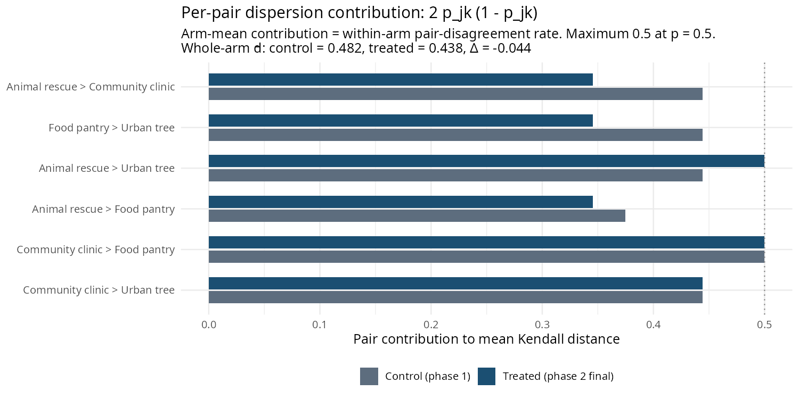
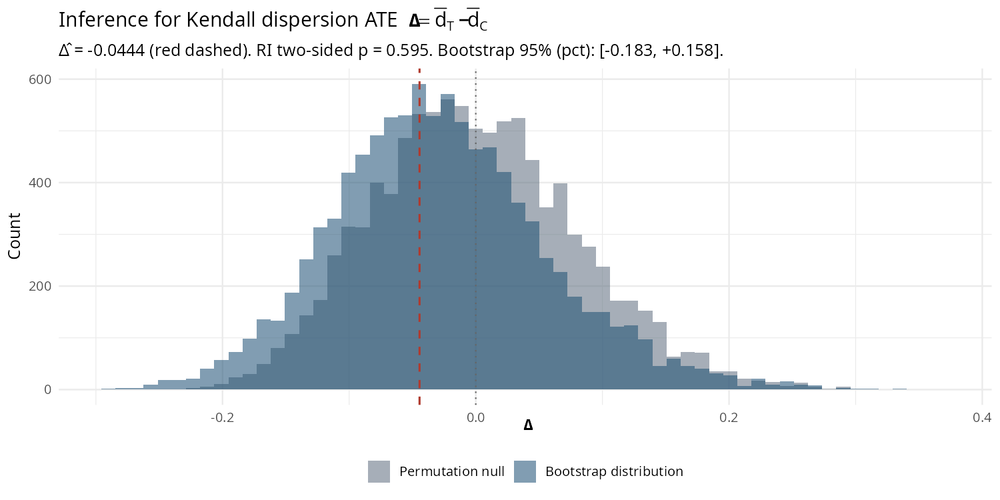
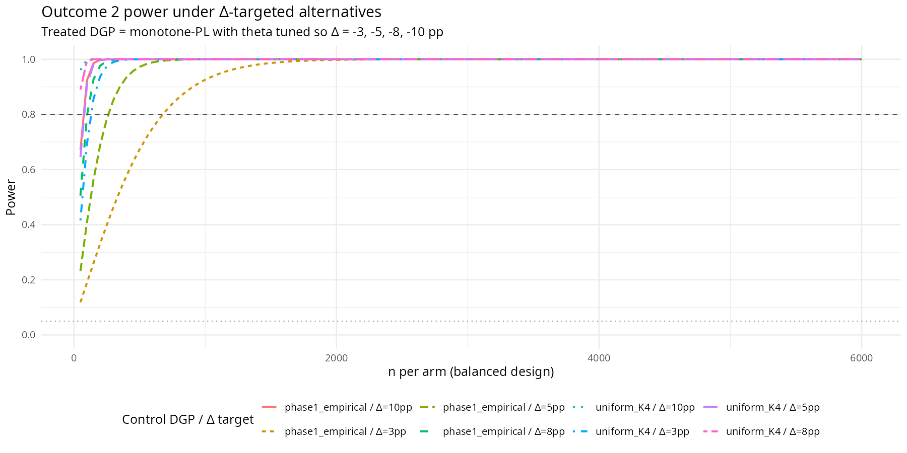

# Kendall dispersion ATE on the Harmonica deliberation pilot

**Outcome 2** of the [analysis plan](../../notes/analysis-plan.md): the difference in average within-arm Kendall distance between two randomly drawn respondents — a scalar measure of whether treatment made rankings more or less mutually coherent.

## Setup

Same two-cohort split as [Outcome 1](../pairwise-preferences/REPORT.md). Phase 1 (n = 12) is the **control arm**, phase 2 *final* rankings (n = 18) are the **treatment arm**. The two cohorts are disjoint at the `user_id` level. Phase-2 *initial* rankings are used only for the within-phase-2 paired companion below; for the headline Δ̂ they are ignored. Full pilot data documentation: [`notes/DATA.md`](../../notes/DATA.md).

This is between-subject. Δ̂ therefore conflates the deliberation effect with any cohort-level difference between the two participant pools — flagged as in Outcome 1.

$K = 4$, giving $\binom{K}{2} = 6$ unordered pairs.

**Reproducibility.** From the repo root:

```
Rscript reports/kendall-dispersion/analysis/run_kendall_dispersion.R         # main analysis
Rscript reports/kendall-dispersion/analysis/run_kendall_dispersion_power.R   # power calcs
```

Permutations $B = 10{,}000$; bootstrap $B = 10{,}000$; seed $20260504$; $\alpha = 0.05$. Outputs land in [`analysis/output/`](analysis/output/) and [`figures/`](figures/). All figures and headline numbers in this document are regenerated by those two commands.

## Methods

### Estimand

For respondent $i$, define the pair-indicator vector $Y_i \in \{0,1\}^{\binom{K}{2}}$ with $Y_{ijk} = 1$ iff $i$ ranks $j$ above $k$. The (normalized) Kendall tau distance between two rankings is the share of pairs they disagree on:

$$d_\tau(R_i, R_{i'}) \;=\; \tfrac{1}{\binom{K}{2}} \sum_{j<k} \mathbb{1}\{Y_{ijk} \ne Y_{i'jk}\}.$$

The within-arm mean Kendall distance is $\bar d_d = E[d_\tau(R_i, R_{i'}) \mid D_i = D_{i'} = d]$ for $d \in \{T, C\}$ and the dispersion ATE is

$$\Delta \;=\; \bar d_T - \bar d_C.$$

A negative $\Delta$ means treated respondents agree with each other more than control respondents do; a positive $\Delta$ means rankings dispersed.

### Two equivalent estimators

**Direct U-statistic.** Average the share of disagreed pairs over all $\binom{n_d}{2}$ within-arm respondent pairs.

**Identity form.** Use the pair-marginal expression from [§77 of the analysis plan](../../notes/analysis-plan.md):

$$\bar d_d \;=\; \tfrac{1}{\binom{K}{2}}\sum_{j<k} 2 p^d_{jk}(1 - p^d_{jk}).$$

These are algebraically identical when the unbiased ($n/(n-1)$ Bessel-corrected) form of the pair-variance is used. We compute both and verify equality to machine precision (sanity check 1).

### Asymptotic SE — Hájek projection

Define the per-respondent Hájek projection

$$h_d(Y_i) \;=\; \tfrac{1}{\binom{K}{2}} \sum_{j<k} \big[(1-Y_{ijk})\,p^d_{jk} + Y_{ijk}(1 - p^d_{jk})\big] \;=\; E_{Y'}\!\big[d_\tau(Y_i, Y')\big].$$

For a degree-2 U-statistic the leading-order variance is $\mathrm{Var}(\bar d_d) \approx 4\,\zeta_1 / n_d$ with $\zeta_1 = \mathrm{Var}(h_d(Y_i))$. Independent arms give

$$\mathrm{SE}(\hat\Delta) \;\approx\; \sqrt{\frac{4\,\zeta_{1,T}}{n_T} + \frac{4\,\zeta_{1,C}}{n_C}},$$

estimated by plugging in sample Hájek-h values. The 95% Hájek CI is $\hat\Delta \pm 1.96\cdot \mathrm{SE}$. **These are descriptive only** — primary inference is the randomization-inference (RI) p-value below. The Hájek formula is accurate when $\zeta_1 > 0$; near $p_{jk} \equiv 0.5$ the $\zeta_1 = 0$ degeneracy bites and the variance scales as $O(1/n^2)$ instead. We discuss this in caveats and rely on simulation to verify the regime in the power section.

### Bootstrap (descriptive companion)

Individual-level resampling: at each bootstrap $b$, draw $n_C$ respondents with replacement from control and $n_T$ respondents with replacement from treated, recompute $\hat\Delta^{*}_b$. Report bootstrap SE, percentile CI, and the bias-corrected basic CI ($2\hat\Delta - q_{0.975}^*, 2\hat\Delta - q_{0.025}^*$) since the percentile bootstrap of a near-quadratic functional like $2p(1-p)$ has a known small-$n$ shrinkage bias.

### Permutation procedure (primary inference)

The 30 respondents are stacked. For each of $B = 10{,}000$ permutations, assign 18 of them at random to the treated arm and 12 to the control arm (`sample.int(30, 18)` — full reshuffle, not sign-flip; the design is between-subject complete randomization), recompute $\bar d^*_T - \bar d^*_C$, and form the permutation null. p-values:

* Two-sided: $p = (1 + \#\{b: |\hat\Delta^*_b| \ge |\hat\Delta_{\text{obs}}|\}) / (B+1)$.
* One-sided lower (treated more coherent): $p = (1 + \#\{b: \hat\Delta^*_b \le \hat\Delta_{\text{obs}}\}) / (B+1)$.

This is exact in size under the sharp null of no individual treatment effect on rankings.

### Within-phase-2 paired companion

Phase 2 has within-respondent pre/post (`initial_ranking`, `final_ranking`). The within-phase-2 paired difference $\Delta_{\text{within}} = \bar d_{\text{post}} - \bar d_{\text{pre}}$ measures whether deliberation tightened or spread the *same* respondents' rankings — this eliminates the cohort confound but addresses a different estimand. We bootstrap respondents preserving the pre/post pairing for a CI, and use a per-respondent pre/post sign-flip RI for the p-value. Reported as a triangulation, not as a substitute for the headline cross-cohort estimate.

## Results

### Headline scalars

| Quantity | Value |
|---|---|
| $\bar d_C$ (control, phase 1) | **0.482** |
| $\bar d_T$ (treated, phase 2 final) | **0.438** |
| **$\hat\Delta = \bar d_T - \bar d_C$** | **$-0.0444$** (= **$-4.4$ pp**) |
| Hájek $\mathrm{SE}(\hat\Delta)$ | $0.079$ |
| Hájek 95% CI | $[-0.199,\,+0.111]$ |
| Bootstrap SE | $0.085$ |
| Bootstrap 95% CI (percentile) | $[-0.183,\,+0.158]$ |
| Bootstrap 95% CI (basic) | $[-0.246,\,+0.095]$ |
| **RI two-sided p** | **$0.595$** |
| RI one-sided p (treated more coherent) | $0.313$ |
| Reject $H_0: \Delta = 0$ at $\alpha = 0.05$? | **No** |

The point estimate is a $4.4$-pp tightening — treated respondents disagree with each other on $43.8\%$ of pairs, control respondents on $48.2\%$. Direction is consistent with the [Outcome 1 anchor](../pairwise-preferences/REPORT.md#%CF%87̂-matrix) (`food_pantry` Condorcet-winning under treatment but not under control: more decisive group ranking ⟹ tighter individual rankings). Under the cross-cohort RI, this is far from significant — wide CIs and $p \approx 0.6$.

The inferential picture combining RI null and bootstrap is in [Figure 2](#figure-2). Asymmetry of the bootstrap distribution around $\hat\Delta$ visualizes the small-sample shrinkage that motivates the basic CI.

### Per-pair decomposition

The identity $\bar d_d = (1/6)\sum_{j<k} 2 p^d_{jk}(1-p^d_{jk})$ decomposes the dispersion into per-pair contributions. Each pair's contribution peaks at $0.5$ when $p_{jk} = 0.5$ and decays toward $0$ as $p_{jk}$ moves toward $0$ or $1$.

| Pair | $p^C$ | $p^T$ | $2p^C(1-p^C)$ | $2p^T(1-p^T)$ | $\Delta_{\text{contrib}}$ |
|---|---:|---:|---:|---:|---:|
| Animal rescue $\succ$ Community clinic | $0.333$ | $0.222$ | $0.444$ | $0.346$ | $-0.099$ |
| Animal rescue $\succ$ Food pantry | $0.250$ | $0.222$ | $0.375$ | $0.346$ | $-0.030$ |
| Animal rescue $\succ$ Urban tree | $0.667$ | $0.500$ | $0.444$ | $0.500$ | **$+0.056$** |
| Community clinic $\succ$ Food pantry | $0.500$ | $0.500$ | $0.500$ | $0.500$ | $0.000$ |
| Community clinic $\succ$ Urban tree | $0.667$ | $0.667$ | $0.444$ | $0.444$ | $0.000$ |
| Food pantry $\succ$ Urban tree | $0.667$ | $0.778$ | $0.444$ | $0.346$ | $-0.099$ |

Five of six pairs either decreased dispersion or stayed flat. **One pair — Animal rescue vs Urban tree — increased dispersion**, moving from a clear majority ($p^C = 0.667$) to a coin-flip ($p^T = 0.500$). That single pair offsets about half of the headline tightening; without it $\hat\Delta$ would be roughly $-7$ pp instead of $-4.4$ pp. This is exactly the kind of pattern Outcome 2 is designed to surface — the marginal majority on AR vs UT [didn't shift far in Outcome 1's $\hat\tau_{jk}$ matrix](../pairwise-preferences/REPORT.md#%CF%84̂-matrix) ($\hat\tau = -0.167$) but the move from $0.67$ toward $0.5$ is exactly the kind of shift that *increases* dispersion under the symmetry-around-$0.5$ identity even as the directional pairwise effect is modest. Outcomes 1 and 2 together flag this pair as where the framing diverges; either alone would miss it.



### Inferential picture

 <a id="figure-2"></a>

The permutation null of $\hat\Delta^*$ is centered at zero with SD $\approx 0.077$; the bootstrap distribution of $\hat\Delta^*$ is centered slightly above $\hat\Delta$ at $-0.028$ (small-sample shrinkage of $2p(1-p)$ functionals). Both distributions overlap heavily with each other and with $\hat\Delta = -0.044$, which is why the RI p-value is large and both CIs cross zero.

### Within-phase-2 paired companion

Phase 2 respondents produce both `initial_ranking` (pre-deliberation) and `final_ranking` (post-deliberation):

| Quantity | Value |
|---|---|
| $\bar d_{\text{pre}}$ (phase 2 initial) | $0.427$ |
| $\bar d_{\text{post}}$ (phase 2 final) | $0.438$ |
| $\Delta_{\text{within}} = \bar d_{\text{post}} - \bar d_{\text{pre}}$ | **$+0.011$** ($+1.1$ pp) |
| Bootstrap SE | $0.027$ |
| Bootstrap 95% CI (percentile) | $[-0.039,\,+0.069]$ |
| Sign-flip RI two-sided p | $0.787$ |

The within-phase-2 paired difference is essentially zero: deliberation does not detectably change the same respondents' mutual ranking coherence between the two waves. Combined with the cross-cohort estimate of $\hat\Delta = -4.4$ pp, the picture is consistent with most of the cross-cohort dispersion gap being **cohort difference rather than deliberation effect** — phase-2 respondents already disperse less than phase-1 respondents at the *initial* wave ($0.427$ vs $0.482$), and their post-deliberation dispersion is barely changed from their pre. This is the kind of triangulation Outcome 2's within-design companion is best at: it doesn't replace the headline, but it does shift the most plausible interpretation of where the cross-cohort signal comes from.

(For reference, Outcome 1's [phase-2 within-design RI](../../analysis/r/run_condorcet_randomization_inference_within_design.R) is the matched analog for the pairwise estimand.)

## Caveats

1. **Cohort confounding (same caveat as Outcome 1).** $\hat\Delta$ is the deliberation effect plus any cohort drift between phases. The within-phase-2 paired companion above is the matched-respondent triangulation; it is not a substitute for proper randomized assignment.
2. **Symmetry-around-$0.5$.** Per the analysis plan, $2p(1-p)$ is symmetric around $p = 0.5$, so a treatment that flips a pairwise majority from $0.4$ to $0.6$ produces *zero* effect on $\Delta$. The Animal-rescue-vs-Urban-tree pair in this pilot illustrates the dual: a shift *toward* $0.5$ increases the dispersion contribution, partially offsetting the tightening on other pairs. Outcome 2 cannot stand alone under a preference-structure framing — it is the coherence companion to the [Outcome 1 pairwise matrix](../pairwise-preferences/REPORT.md#%CF%84̂-matrix), and we do not headline it.
3. **"Dispersion," not "polarization."** Higher $\bar d$ is consistent with several DGPs: factional clustering, random noise around a common ranking, or covariate-heterogeneous responses. Polarization specifically requires bimodality / clustering structure that this scalar cannot identify. We use "dispersion" throughout.
   * Lightweight covariate sub-cohort check: splitting the treated arm at median session duration ($13.7$ min) gives $\bar d_{\text{short}} = 0.324$ ($n=9$) and $\bar d_{\text{long}} = 0.472$ ($n=9$) — short-duration treated respondents are markedly more coherent than long-duration ones. With $n=9$ per half this is illustrative only and consistent with either selection (decisive participants finish faster) or differential treatment effect along duration. A proper polarization check would require pre-registered covariate-clustering at meaningful $n$; we do not run one here.
4. **Pilot-grade $n$.** With $(n_C, n_T) = (12, 18)$ each respondent contributes substantially to within-arm pair-disagreement counts; flipping one respondent from a typical to an atypical ranking moves $\bar d$ by roughly $1$–$2$ pp. The RI is exact in size but power is low (see power section). The observed non-rejection is consistent with a meaningful population-level effect that this pilot cannot resolve, and equally with no effect at all.
5. **Bootstrap small-sample bias.** Bootstrap mean lands at $\hat\Delta + 0.017$ rather than at $\hat\Delta$ itself, because $2p(1-p)$ is concave in $p$ and bootstrapping respondents creates a downward (toward $0.5$) shrinkage in resampled $p^*$, which shifts $2p^*(1-p^*)$ contributions upward (i.e., toward larger dispersion) and thereby toward smaller $|\hat\Delta^*|$ on average. The basic CI corrects this bias; we report both percentile and basic.
6. **Multiplicity scope.** Outcome 2 is a single scalar test, no multiplicity correction needed. We do not bundle Outcome 1's per-pair tests with Outcome 2 into a combined family — the sample is the same but the testing scope is different.
7. **$\zeta_1$ degeneracy at uniform.** When the population has $p_{jk} \equiv 0.5$ for every pair (exactly uniform), the Hájek h-values are constant across respondents and $\zeta_1 = 0$. The leading-order asymptotic SE is then zero and the variance is dominated by the second-order $\zeta_2/n^2$ term. The pilot empirical levels are not at this degenerate point ($\zeta_{1,C} \approx 0.010$, $\zeta_{1,T} \approx 0.007$), but the power calculations under "uniform K=4" control hit the degeneracy and should not be used as planning numbers; see the power section.

## Power calculations

The pilot does not reject. The natural design question is then: at what $n$ does Outcome 2 reach $80\%$ power against a target $\Delta$? Computations are in [`analysis/run_kendall_dispersion_power.R`](analysis/run_kendall_dispersion_power.R); outputs in [`analysis/output/power_n_required_*.csv`](analysis/output/) and [`analysis/output/power_curve.csv`](analysis/output/power_curve.csv).

### Asymptotic recipe

Under the alternative $\Delta \ne 0$ at fixed levels $(p^C, p^T)$, the test statistic $Z = \hat\Delta / \mathrm{SE}(\hat\Delta) \to \mathcal{N}(\Delta/\mathrm{SE},\,1)$. Two-sided $\alpha$-level power is

$$\mathrm{power}(n) \;=\; \Phi\!\Big(\tfrac{|\Delta|}{\mathrm{SE}(n)} - z_{1-\alpha/2}\Big) + \Phi\!\Big(-\tfrac{|\Delta|}{\mathrm{SE}(n)} - z_{1-\alpha/2}\Big),$$

with $\mathrm{SE}(n) = \sqrt{4\zeta_{1,T}/n + 4\zeta_{1,C}/n}$ for balanced arms. We compute $\zeta_{1,d}$ and $\bar d_d$ on $M = 50{,}000$ simulated respondents under each cell's DGP.

### Two specifications

The choice of alternative for Outcome 2 differs from Outcome 1 because $\Delta$ depends on **levels**, not only on $\tau$. The same $\tau$ vector at RMS $= 3$ pp produces wildly different $\Delta$ depending on $p^C$.

**Specification A — Outcome-1 RMS = 3 pp alternatives.** Take the same four cells used in Outcome 1's power section: $\{$uniform-$K_4$, phase-1 empirical$\} \times \{$diffuse PL, pilot-proportional$\}$. For each cell, *induced* $\Delta$ is whatever the alternative gives.

| Control DGP | $\hat\tau$ shape | Induced $\Delta$ | $n^{*}$/arm for $80\%$ |
|---|---|---:|---:|
| phase-1 empirical | diffuse PL | **$+5.85$ pp** | **$100$** |
| phase-1 empirical | pilot-proportional | $+0.02$ pp | **n/a (undetectable)** |
| uniform $K_4$ | diffuse PL | $-0.17$ pp | (formula degenerate) |
| uniform $K_4$ | pilot-proportional | $-0.11$ pp | (formula degenerate) |

Two readings here. First, under phase-1 empirical control, the diffuse PL alternative at RMS $= 3$ pp produces $\Delta \approx +5.85$ pp — i.e., it makes treated rankings *more* dispersed than control, because phase-1 control is already coherent (mean $p^C \approx 0.55$, contributions averaging $0.44$) and diffuse PL with mild $\theta$ produces near-uniform marginals. Same RMS, opposite *sign* on $\Delta$ depending on starting point. Second, the pilot-proportional shape rescaled to RMS $= 3$ pp produces essentially no $\Delta$ at all under phase-1 empirical control because the per-pair contributions sign-cancel (some pairs move toward $0.5$, others away). The uniform-$K_4$ rows hit the $\zeta_1 = 0$ degeneracy and the asymptotic formula gives nonsense; do not use them.

The takeaway is exactly the symmetry-around-$0.5$ caveat with numbers: **same Outcome-1 alternative produces $\Delta$ ranging from "undetectable at any n" to "easily detectable at $n = 100$/arm" depending on the shape**. You cannot translate Outcome 1's power planning into Outcome 2's without specifying $p^C$ as well as $\tau$.

**Specification B — direct $\Delta$ targets.** Specify $|\Delta| \in \{3, 5, 8, 10\}$ pp directly. Treated DGP is monotone PL with $\theta = c \cdot (1,2,3,4)$ where $c$ is tuned via `uniroot` so the induced $\bar d_T - \bar d_C$ matches the target. Sign is negative (treated tighter).

| Control DGP | Target $|\Delta|$ | Realized $\Delta$ | $n^{*}$/arm for $80\%$ |
|---|---:|---:|---:|
| phase-1 empirical | $3$ pp | $-2.96$ pp | $700$ |
| phase-1 empirical | $5$ pp | $-4.90$ pp | **$300$** |
| phase-1 empirical | $8$ pp | $-8.09$ pp | $150$ |
| phase-1 empirical | $10$ pp | $-9.93$ pp | $100$ |
| uniform $K_4$ | $3$ pp | $-3.03$ pp | $150$ |
| uniform $K_4$ | $5$ pp | $-4.96$ pp | $100$ |
| uniform $K_4$ | $8$ pp | $-8.09$ pp | $50$ |
| uniform $K_4$ | $10$ pp | $-10.05$ pp | $50$ |

The pilot's observed $|\hat\Delta| = 4.4$ pp lands between the $3$ pp and $5$ pp rows of the phase-1-empirical block — to detect the pilot point estimate at $80\%$ power one would need roughly **$400$–$500$** per arm under that DGP family. Compare with Outcome 1's headline $n^{*} = 2{,}000$/arm under the diffuse PL alternative at RMS $= 3$ pp, phase-1 control: at the same alternative, Outcome 2's $\Delta$ is in fact large enough ($+5.85$ pp) that $n^{*} = 100$/arm suffices. But that's a coincidence of the alternative, not a property of the statistic — at the pilot-proportional shape Outcome 2 needs $\infty$ while Outcome 1 still has signal.



### Simulation verification

Empirical power of the asymptotic Z-test at the headline cell (phase-1 empirical control, $\Delta \approx -5$ pp; $S = 200$ datasets, full Hájek-SE inference per dataset):

| $n$/arm | Empirical power |
|---:|---:|
| $100$ | $0.42$ |
| $300$ | **$0.89$** |
| $500$ | $0.98$ |

The asymptotic prediction at $n = 300$ is $80\%$; the simulation gives $89\%$. The Hájek formula is well-calibrated when $\zeta_1 > 0$. We do not provide a simulation check for the uniform cells because $\zeta_1 = 0$ there and the asymptotic formula is the wrong reference.

### No DiD variant

Outcome 1's variance-reduction-via-DiD argument (variance of $\hat\tau$ scales by $2(1-\rho)$ under within-respondent pre/post) does not transfer to Outcome 2: dispersion is intrinsically a between-respondents kernel, and "the same respondent's change in dispersion" is not a meaningful unit of observation. The within-phase-2 paired companion in the main analysis is the analog — a *different* estimand that triangulates the cross-cohort headline rather than reducing its variance.

### Caveats specific to power

1. **Specification choice matters.** Outcome 2 power is set by levels not just $\tau$. Pre-registering both $p^C$ assumptions and the $\Delta$ target (or the $\tau$ shape together with starting $p^C$) is necessary.
2. **Degeneracy at uniform.** The asymptotic formula breaks down where $\zeta_1 = 0$. The uniform-$K_4$ Outcome-1-alternative rows in Spec A are formally invalid; we keep them in the table marked as such for completeness rather than as planning numbers.
3. **PL is convenient, not the only model.** Treated DGPs in the power tables are all monotone PL (drawn via the Gumbel-max trick). Other ranking models (Mallows, Bradley-Terry with asymmetric utilities) would yield different $\zeta_{1,T}$ at the same $\Delta$. Sensitivity to ranking-model family is not explored; for follow-up planning at large $n$, the variance-from-PL approximation is generally a reasonable but not tight upper bound on $\zeta_1$.
4. **RMS = $3$ pp is a planning value imported from Outcome 1, not a pre-registered effect for Outcome 2.** Specification A's induced $\Delta$ values depend mechanically on $p^C$ and have no direct interpretation as a "dispersion target."
5. **Asymptotic, not exact.** Z-test asymptotics. At $n \ge 100$/arm under non-degenerate $\zeta_1$ the simulation shows tight calibration (within $\sim$ 5 pp of predicted).

## What this report does **not** do

- **Outcome 3 (rule-output panel).** Planned as a follow-up; existing partial implementations live in [`analysis/r/`](../../analysis/r/), notably [`run_phase2_resampling_social_choice.R`](../../analysis/r/run_phase2_resampling_social_choice.R).
- **Polarization decomposition.** Per the analysis plan, this would require a pre-registered covariate-clustering check at meaningful sample size; the lightweight median-duration split is illustrative only.
- **Covariate adjustment.** Unconditional ATE between cohorts.
- **DiD variance-reduction power.** Different estimand structure — see the explanation above.

## Verification (sanity-check pass / fail)

All seven sanity checks built into the script passed when run on the locked seed (the bootstrap-bias check raises a tracked warning, not a failure):

1. **Identity == direct.** $\bar d_d$ computed via $2p(1-p)$ identity matches the direct U-statistic computed pair-by-pair, both arms, max abs error $0$ to machine precision.
2. **Bounds.** $\bar d_C = 0.482 \in [0, 0.5]$, $\bar d_T = 0.438 \in [0, 0.5]$ (max $0.5$ attained when all $p_{jk} = 0.5$).
3. **Hájek mean centering.** $\overline{h_d(Y)} = ((n_d-1)/n_d)\,\bar d_d$ to machine precision (max abs err $5.6 \times 10^{-17}$); the small offset reflects the U-statistic's omission of $i = i'$ self-pairs.
4. **Decomposition reconstructs $\hat\Delta$.** $(n_T/(n_T-1))\,\overline{2p^T(1-p^T)} - (n_C/(n_C-1))\,\overline{2p^C(1-p^C)} = \hat\Delta$ to machine precision.
5. **Permutation-null centeredness.** Mean of $\hat\Delta^*$ over $B = 10{,}000$ permutations is $-1.2 \times 10^{-4}$, well within $5/\sqrt{B} \approx 0.004$.
6. **Bootstrap bias.** Bootstrap mean is $\hat\Delta + 0.017$ (downward shrinkage of $|\hat\Delta^*|$), expected for $2p(1-p)$ functionals at small $n$; the basic CI uses this bias estimate to debias the percentile interval.
7. **Replication anchor.** Per [`phase2_final_voting_rules.csv`](../../analysis/output/phase2_final_voting_rules.csv) `food_pantry` is the phase-2-final Condorcet winner; phase 1 has none. A more decisive group ranking suggests tighter individual rankings → expect $\hat\Delta < 0$. Observed $\hat\Delta = -0.044$, consistent.

## Outputs

**Main analysis** — produced by [`analysis/run_kendall_dispersion.R`](analysis/run_kendall_dispersion.R):

- [`analysis/output/kendall_dispersion.csv`](analysis/output/kendall_dispersion.csv) — headline scalars: $\bar d$, $\hat\Delta$, Hájek/bootstrap SE & CI, RI two-sided and one-sided p-values.
- [`analysis/output/pair_dispersion_decomposition.csv`](analysis/output/pair_dispersion_decomposition.csv) — per-pair $p^d_{jk}$ and contribution $2p^d_{jk}(1-p^d_{jk})$, both arms, plus $\Delta_{\text{contrib}}$.
- [`analysis/output/hajek_components.csv`](analysis/output/hajek_components.csv) — per-respondent Hájek-projection $h$ values for both arms.
- [`analysis/output/perm_null_summary.csv`](analysis/output/perm_null_summary.csv) — permutation-null mean, sd, quantiles.
- [`analysis/output/bootstrap_summary.csv`](analysis/output/bootstrap_summary.csv) — bootstrap mean, sd, bias, percentile and basic CIs.
- [`analysis/output/within_phase2_results.csv`](analysis/output/within_phase2_results.csv) — paired $\bar d_{\text{post}} - \bar d_{\text{pre}}$ within phase 2.
- [`figures/dispersion_decomposition.png`](figures/dispersion_decomposition.png), [`figures/delta_distribution.png`](figures/delta_distribution.png).

**Power calculations** — produced by [`analysis/run_kendall_dispersion_power.R`](analysis/run_kendall_dispersion_power.R):

- [`analysis/output/power_n_required_rms.csv`](analysis/output/power_n_required_rms.csv) — $n^*$ per cell under the four Outcome-1 RMS = 3 pp alternatives (Specification A).
- [`analysis/output/power_n_required_delta.csv`](analysis/output/power_n_required_delta.csv) — $n^*$ at directly specified $|\Delta|$ targets (Specification B).
- [`analysis/output/power_curve.csv`](analysis/output/power_curve.csv) — power versus $n$ across all cells.
- [`analysis/output/power_simulation_check.csv`](analysis/output/power_simulation_check.csv) — simulation verification at the headline ($\Delta = -5$ pp, phase-1 control) cell.
- [`figures/power_curves_rms.png`](figures/power_curves_rms.png), [`figures/power_curves_delta.png`](figures/power_curves_delta.png).

R 4.5.3, ggplot2 3.5.2, dplyr 1.1.4, readr 2.1.5, stringr 1.5.1, tibble 3.2.1, tidyr 1.3.1.
