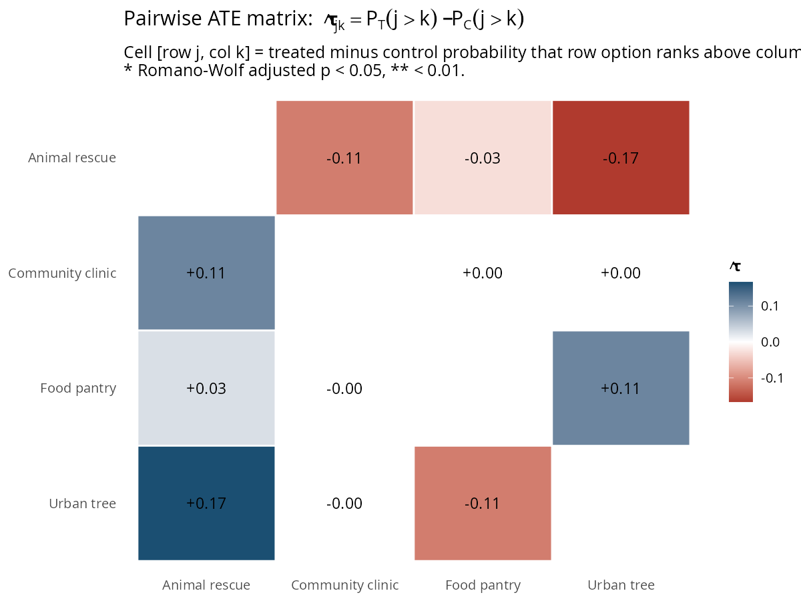
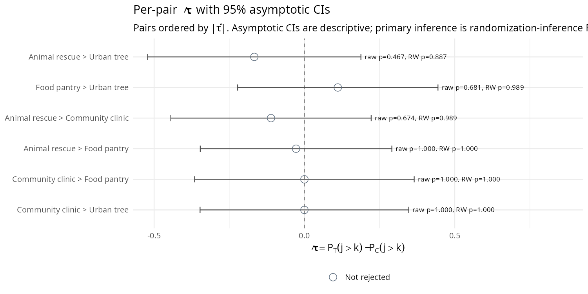
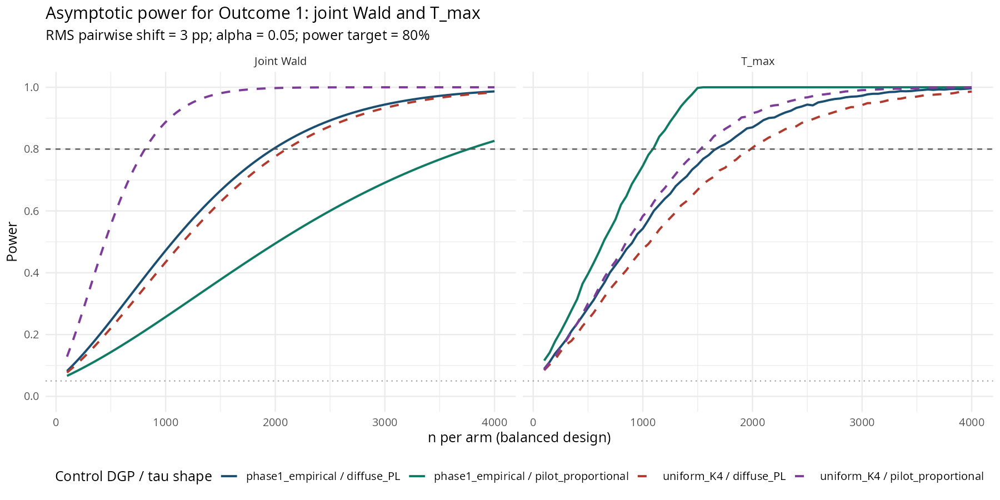
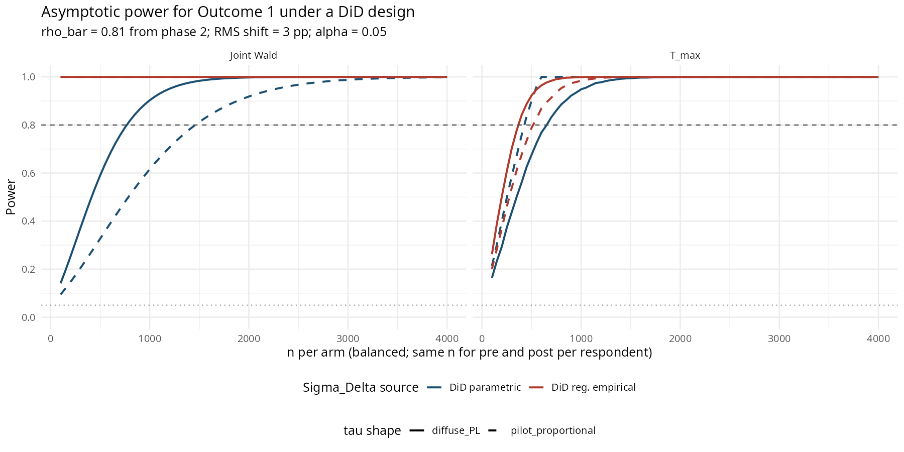

# Pairwise preference ATE on the Harmonica deliberation pilot

**Outcome 1** of the [analysis plan](../../notes/analysis-plan.md): for every pair of options, the treatment-minus-control probability that the first is ranked above the second.

## Setup

The Harmonica pilot is a two-phase deliberation experiment in which respondents rank four NYC charities (`animal_rescue`, `community_clinic`, `food_pantry`, `urban_tree`) for a hypothetical $10 donation. Phase 1 (n = 12) is treated as the **control arm**: respondents read static descriptions and produce a single ranking. Phase 2 (n = 18) is treated as the **treatment arm**: respondents produce an initial ranking, are exposed to anonymised rephrasings of phase-1 reasoning, and produce a `final_ranking`. The two cohorts are disjoint at the `user_id` level. We use phase-2 *final* rankings only; the phase-2 initial rankings are out of scope for Outcome 1.

This is between-subject, not within-subject. Estimated effects therefore conflate the deliberation effect with any cohort-level difference between the two participant pools. We flag this prominently and treat it as a load-bearing caveat throughout.

$K = 4$, giving $\binom{K}{2} = 6$ unordered pairs. Full pilot data documentation: [`notes/DATA.md`](../../notes/DATA.md).

**Reproducibility.** From the repo root:

```
Rscript reports/pairwise-preferences/analysis/run_pairwise_ate.R         # main analysis
Rscript reports/pairwise-preferences/analysis/run_pairwise_ate_power.R   # power calcs
```

Main-analysis permutations $B = 10{,}000$; multivariate-normal draws for $T_{\max}$ critical $B = 20{,}000$; seed $20260504$; $\alpha = 0.05$. Outputs land in [`analysis/output/`](analysis/output/) and [`figures/`](figures/). All figures and headline numbers in this document are regenerated by those two commands.

## Methods

### Estimand

Index pairs $(j, k)$ over the 6 unordered combinations with $j < k$ alphabetically by code. For respondent $i$, define $Y_{ijk} = 1$ if $i$ ranks $j$ above $k$. Arm-$d$ means are $p^d_{jk}$; the pairwise ATE is

$$\tau_{jk} \;=\; p^T_{jk} - p^C_{jk}.$$

A positive $\tau_{jk}$ means treated respondents are more likely than control respondents to put $j$ above $k$. Per Outcome 1 in the analysis plan, we report the full 6-vector of $\hat\tau_{jk}$, the level matrices $p^T_{jk}$ and $p^C_{jk}$, an omnibus joint test, and the RMS magnitude scalar

$$\mathrm{RMS} \;=\; \sqrt{\tfrac{1}{6}\sum_{j<k}\hat\tau_{jk}^2}.$$

We deliberately do **not** report a mean signed shift across pairs — it depends on the labelling convention for which option of a pair is "first" and is meaningless without a substantive ordering.

### Per-pair point estimate, descriptive standard error, and asymptotic CI

For each pair, $\hat\tau_{jk} = \hat p^T_{jk} - \hat p^C_{jk}$ (unsmoothed). For the descriptive standard error we use the Wald-binomial difference

$$\mathrm{SE}_{jk} \;=\; \sqrt{\frac{\tilde p^T_{jk}(1-\tilde p^T_{jk})}{n_T} \;+\; \frac{\tilde p^C_{jk}(1-\tilde p^C_{jk})}{n_C}}$$

with $\tilde p = (n\hat p + 0.5)/(n+1)$ Laplace-stabilised proportions used **only inside the SE** so that pairs whose observed proportions land at $0$ or $1$ do not yield a degenerate $\mathrm{SE} = 0$. The 95% asymptotic CI is $\hat\tau \pm 1.96\cdot\mathrm{SE}$. **These are descriptive only** — primary inference is the randomization-inference (RI) p-value below.

### Permutation procedure (primary inference)

The 30 respondents are stacked. For each of $B = 10{,}000$ permutations we assign 18 of them at random to the treated arm and 12 to the control arm (`sample.int(30, 18)` — full reshuffle, not sign-flip; the design is between-subject complete randomization), recompute $\hat p^T_{jk}$, $\hat p^C_{jk}$, $\hat\tau^*_{jk}$, and the studentised statistic $\hat t^*_{jk} = \hat\tau^*_{jk} / \mathrm{SE}^*_{jk}$ using the SE recomputed on the permuted split. (Re-studentising on each permutation is what gives Romano–Wolf its asymptotic correctness.) This yields a $6 \times B$ null matrix of $\hat t^*$ and of $\hat\tau^*$.

### Joint omnibus

We report two complementary statistics, both regenerated by the script:

1. **Asymptotic Wald with Moore-Penrose pseudoinverse.** Build the $6 \times 6$ covariance of $\hat\tau$ as $\hat\Sigma = \mathrm{cov}(Y_T)/n_T + \mathrm{cov}(Y_C)/n_C$. Take $\hat\Sigma^{+}$ via `MASS::ginv` and report the SVD-determined rank explicitly: $W = \hat\tau^{\top}\,\hat\Sigma^{+}\,\hat\tau$ is referenced to $\chi^2_{\mathrm{rank}}$. We do **not** silently use $\chi^2_6$.
2. **Permutation joint statistics.** $T_{\max} = \max_{jk}|t_{jk}|$ and $T_{\mathrm{SS}} = \sum_{jk} t_{jk}^2$. p-values from the permutation null: $(1 + \#\{b: T^*_b \ge T_{\mathrm{obs}}\}) / (B+1)$. These sidestep any rank-deficiency in $\hat\Sigma$ and respect the joint null dependence.

### Romano–Wolf step-down (FWER across the 6 pairs)

Studentised step-down with max-$|t|$ null reconstruction, monotonicity enforced:

1. Compute $t_{jk} = \hat\tau_{jk} / \mathrm{SE}_{jk}$.
2. Sort pairs by $|t_{jk}|$ descending: $\pi(1), \dots, \pi(6)$.
3. Active set $A \gets \{\pi(1), \dots, \pi(6)\}$.
4. For $s = 1, \dots, 6$:
   * For each permutation $b$, compute $T^*_{s,b} = \max_{jk \in A}|t^*_{jk,b}|$.
   * $p^{\mathrm{raw}}_s = \dfrac{1 + \#\{b: T^*_{s,b} \ge |t_{\pi(s)}|\}}{B + 1}$.
   * $p^{\mathrm{adj}}_{\pi(s)} = \max\bigl(p^{\mathrm{raw}}_s,\; p^{\mathrm{adj}}_{\pi(s-1)}\bigr)$ (monotonicity).
   * $A \gets A \setminus \{\pi(s)\}$.
5. Reject $H_{0,jk}$ at level $\alpha$ iff $p^{\mathrm{adj}}_{jk} \le \alpha$.

Romano–Wolf is the pre-registered procedure. Benjamini–Hochberg FDR is a defensible alternative for a discovery-set framing; we do not compute it.

## Results

### Headline scalars

| Quantity | Value |
|---|---|
| **RMS pairwise shift** | **0.094** (= **9.4 pp**) |
| Joint Wald $W$ | 6.26 |
| $\hat\Sigma$ rank | 6 (full) |
| Wald $\chi^2_6$ p | 0.394 |
| Permutation $T_{\max}$ | 0.92 |
| Permutation $T_{\max}$ p | **0.887** |
| Permutation $T_{\mathrm{SS}}$ | 1.73 |
| Permutation $T_{\mathrm{SS}}$ p | **0.907** |
| Joint reject @ $\alpha = 0.05$? | **No** (all three tests) |

The point estimate of preference movement is non-trivial — the RMS shift is roughly 9 percentage points, with the largest single-pair shift at 17 pp — but the pilot is too small to reject the joint null. The Wald $\chi^2$, the permutation $T_{\max}$, and the permutation $T_{\mathrm{SS}}$ all give p > 0.39.

(I had originally guessed $\hat\Sigma$ would be rank-deficient at $K = 4$ — that intuition was for rank vectors. Pair-indicator covariance matrices for $K = 4$ strict rankings are full-rank-6 generically, and the empirical $\hat\Sigma$ here is rank $6$ by SVD.)

### $\hat\tau$ matrix

Cell $[\text{row } j, \text{col } k]$ is $\hat\tau_{j \succ k} = P_T(j \succ k) - P_C(j \succ k)$. The matrix is anti-symmetric (verified to machine precision). No cell rejects under Romano–Wolf at $\alpha = 0.05$ (smallest RW-adjusted p = 0.887; see [Figure 2](#figure-2) and [`pairwise_ate.csv`](analysis/output/pairwise_ate.csv) for the per-pair table).



### Per-pair detail (sorted by $|\hat\tau|$)

| Pair | $\hat\tau$ | SE | 95% asymp CI | raw RI p | RW-adj p |
|---|---:|---:|:---:|---:|---:|
| Animal rescue $\succ$ Urban tree | $-0.167$ | $0.181$ | $[-0.521,\,+0.188]$ | $0.467$ | $0.887$ |
| Animal rescue $\succ$ Community clinic | $-0.111$ | $0.170$ | $[-0.444,\,+0.222]$ | $0.674$ | $0.989$ |
| Food pantry $\succ$ Urban tree | $+0.111$ | $0.170$ | $[-0.222,\,+0.444]$ | $0.681$ | $0.989$ |
| Animal rescue $\succ$ Food pantry | $-0.028$ | $0.163$ | $[-0.346,\,+0.291]$ | $1.000$ | $1.000$ |
| Community clinic $\succ$ Food pantry | $0.000$ | $0.186$ | $[-0.365,\,+0.365]$ | $1.000$ | $1.000$ |
| Community clinic $\succ$ Urban tree | $0.000$ | $0.177$ | $[-0.347,\,+0.347]$ | $1.000$ | $1.000$ |

 <a id="figure-2"></a>

### Level matrices (for verification)

Probabilities $p^T_{jk}$ (treated) and $p^C_{jk}$ (control) that the first option in each pair is ranked above the second:

| Pair | $p^T$ | $p^C$ |
|---|---:|---:|
| Animal rescue $\succ$ Community clinic | $0.222$ | $0.333$ |
| Animal rescue $\succ$ Food pantry | $0.222$ | $0.250$ |
| Animal rescue $\succ$ Urban tree | $0.500$ | $0.667$ |
| Community clinic $\succ$ Food pantry | $0.500$ | $0.500$ |
| Community clinic $\succ$ Urban tree | $0.667$ | $0.667$ |
| Food pantry $\succ$ Urban tree | $0.778$ | $0.667$ |

Sanity-check anchor: per [`phase2_final_voting_rules.csv`](../../analysis/output/phase2_final_voting_rules.csv) `food_pantry` is the phase-2-final Condorcet winner while phase 1 has none. The food-pantry row of $\hat\tau$ averages $+0.046$ (positive vs. each of urban_tree, animal_rescue, and tied vs. community_clinic), consistent with food_pantry tipping into Condorcet-winner status under treatment without a single pair shifting dramatically.

## Caveats

1. **Cohort confounding.** The two arms are different participant pools. $\hat\tau_{jk}$ is the deliberation effect plus any cohort drift between phases. The within-design pre/post structure inside phase 2 (`initial_ranking` vs `final_ranking`) is not used here; see the within-design RI script in [`analysis/r/run_condorcet_randomization_inference_within_design.R`](../../analysis/r/run_condorcet_randomization_inference_within_design.R) for an analysis that does.
2. **Pairwise marginals do not identify the joint ranking distribution.** For $K \ge 4$, many distinct ranking distributions can produce the same six pairwise marginals (see [analysis-plan §41](../../notes/analysis-plan.md)). The matrix is the right primary projection of preference structure, not the entire object. Outcome 2 (Kendall dispersion) and Outcome 3 (rule-output panel) take the joint distribution as input.
3. **Pilot-grade $n$.** With $(n_C, n_T) = (12, 18)$, a single respondent flips multiple pairwise indicators by ~6–8 pp. The RI is exact in size, but power against any plausible effect is limited; even a $17$ pp point estimate has a 95% asymptotic CI of width $0.7$. The observed non-rejection of the joint null is consistent with a meaningful population-level effect that this pilot cannot resolve, and equally with no effect at all.
4. **Multiplicity scope.** The Romano–Wolf family is the 6 pairs only. We do not bundle Outcome 2 / Outcome 3 statistics into the same family; that would be a different pre-registration.
5. **$\hat\Sigma$ pseudoinverse is unnecessary in this dataset (rank $= 6$) but kept for portability.** A future replication with different $K$, or with rankings that happen to leave $\hat\Sigma$ rank-deficient at small $n$, would need the pseudoinverse and the rank-aware df.

## Literature comparison

I want to know whether the observed $9.4$ pp RMS shift is plausible for a deliberation-style intervention. The relevant literature spans three families: deliberative polling (closest design analogue — pre/post within-cohort attitude shifts on policy options), small-group deliberation experiments on distributional preferences, and field-experiment persuasion (looser analogue — usually about candidate vote share, not pairwise ranking).

**Headline magnitudes from each family.**

| Source | Design | Typical pp shift on individual items | Notes |
|---|---|---|---|
| Luskin, Fishkin, & Jowell (2002) | UK deliberative poll on crime, 1994 | 3–6 pp aggregate change pre/post | Cited by [Wikipedia summary](https://en.wikipedia.org/wiki/Deliberative_opinion_poll) and the [Stanford Deliberative Democracy Lab](https://deliberation.stanford.edu/what-deliberative-pollingr) |
| Azmanova (2011), via [Critical Review](https://www.tandfonline.com/doi/full/10.1080/08913811.2011.635872) | 12-question reanalysis of deliberative-poll evidence | 1–4 pp aggregate change for most items | "About two-thirds of opinion items shift" but most modestly |
| Japan Energy Policy DP, 2012 | Large deliberative poll | Support for zero-nuclear: 32.6 → 41.1 → 46.7% (~14 pp over two waves) | Atypically strong; salience-driven |
| Suhay, Brandt, & Proulx — small-group distributional deliberation experiments | Lab, 10-min written deliberation | "Significantly more egalitarian post" — single-digit pp on aggregate split preferences | Closer to our task in cognitive style |
| Kalla & Broockman (2018) [APSR](https://www.cambridge.org/core/journals/american-political-science-review/article/abs/minimal-persuasive-effects-of-campaign-contact-in-general-elections-evidence-from-49-field-experiments/753665A313C4AB433DBF7110299B7433) | Meta-analysis of 49 field experiments on US general-election campaigning | ~0 pp average; rare exceptions in unusual circumstances | Different setting (campaign contact, not deliberation) but anchors the lower bound for "ambient persuasion" |

**Reading the numbers.** Deliberative-polling literature centres aggregate single-item attitude change around $3$–$6$ pp for a typical item, with occasional $10$–$15$ pp shifts on issues where deliberation surfaces salient new information. Small-group deliberation experiments on distributional preferences are in a similar range. Pure persuasion-by-contact (Kalla & Broockman) is essentially zero on candidate choice. None of these targets is *quite* the same as a pairwise ranking shift on a fixed option set — deliberative polling typically reports per-question support percentages on policy items, not $\binom{K}{2}$ pair shifts on a ranking — but the units are commensurable: in both cases the dependent variable is a per-item proportion difference between pre and post (or T and C) cohorts.

**Where the pilot lands.** The observed RMS pairwise shift is $9.4$ pp; the largest single-pair shift is $16.7$ pp. Both are *above* the deliberative-polling median per-item change but well within the literature's heavy tail (the Japan DP zero-nuclear shift is $\sim\!14$ pp; deliberative-polling outliers reach $15$–$20$ pp on salient items). Compared to the persuasion-by-contact baseline of essentially zero, the point estimates are large.

**Caveats on this comparison.**
- Deliberative-polling shifts are within-cohort pre/post under intensive multi-day weighted-sample treatment with expert briefing. The Harmonica pilot is between-cohort with a brief AI-mediated chat. Direction of bias from this difference is not obvious; the comparison is loose.
- A pairwise ranking shift averages across more potential noise than a single attitude question, so for the same underlying treatment intensity, RMS shifts on a 6-pair vector should be *smaller* than the single largest item-level shift, which makes $9.4$ pp RMS a fairly strong point estimate.
- The 95% asymptotic CIs on individual pairs span $\sim\!0.7$ in width; the observed point estimates are entirely consistent with population effects in the literature's typical range *and* with a true effect of zero. The pilot can place point estimates but cannot discriminate between hypotheses inside the literature-anchored range. That is exactly what a pilot of this size should do.

## Power calculations

The pilot does not reject the joint null. The natural design question is then: at what $n$ does Outcome 1 reach 80% power against a target effect? This section answers that for an RMS pairwise shift of $3$ pp under both the pre-registered joint Wald omnibus and the alternative $T_{\max}$ statistic. Computations are in [`analysis/run_pairwise_ate_power.R`](analysis/run_pairwise_ate_power.R); outputs in [`analysis/output/power_n_required.csv`](analysis/output/power_n_required.csv) and [`analysis/output/power_curve.csv`](analysis/output/power_curve.csv).

### Estimand of "$3$ pp effect"

A scalar magnitude $\mathrm{RMS}(\tau) = \sqrt{(1/6)\sum_{j<k}\tau_{jk}^2} = 0.03$ does not pin down the alternative — same RMS, different shapes give very different power. We sweep two shapes:

- **Diffuse Plackett–Luce** ($\tau_{\text{diffuse}}$): treated drawn from PL with monotone evenly-spaced utilities $\theta_T = c\cdot(1,2,3,4)$, $c$ tuned so RMS $= 0.03$. All six pairs shift; the three "distance-1" pairs shift by $\sim\!1.6$ pp, the two "distance-2" pairs by $\sim\!3.3$ pp, the one "distance-3" pair by $\sim\!4.9$ pp.
- **Pilot-proportional** ($\tau_{\text{pilot}}$): treated $\tau$ direction taken from the observed pilot $\hat\tau$ vector, rescaled to RMS $= 0.03$. Three of six pairs are exactly zero (animal_rescue $\succ$ urban_tree, animal_rescue $\succ$ community_clinic, food_pantry $\succ$ urban_tree get the signal; the other three are zero by construction).

We also sweep two control DGPs: **phase-1 empirical bootstrap** (anchors $\Sigma_Y$ to the actual pilot's pair-indicator structure, $\mathrm{rank}(\Sigma_Y)=4$) and **uniform on $K=4$ rankings** (clean parametric reference, $\mathrm{rank}(\Sigma_Y)=6$).

### Recipe

For balanced arms with $n$ per arm, $\Sigma_{\hat\tau} = (2/n)\,\Sigma_Y$ assuming $\Sigma_Y^T \approx \Sigma_Y^C$ — exact under uniform-vs-shifted-PL by symmetry, and a reasonable approximation under bootstrap-vs-shifted-bootstrap for small effects.

**Joint Wald.** Noncentrality $\lambda(n) = \hat\tau^{\top}\Sigma_{\hat\tau}^{+}\hat\tau = (n/2)\,\tau^{\top}\Sigma_Y^{+}\tau$. Power $= 1 - F_{\chi^2_r(\lambda)}(\chi^2_{r,\,1-\alpha})$, with $r = \mathrm{rank}(\Sigma_Y)$.

**$T_{\max}$.** Under H0, $(t_1,\dots,t_6) \sim \mathcal{N}(0, C)$ where $C$ is the correlation matrix derived from $\Sigma_Y$. Critical value $c$ is the $(1-\alpha)$ quantile of $\max_p|Z_p|$ under $\mathcal{N}(0, C)$. Under H1, $(t_1,\dots,t_6) \sim \mathcal{N}(\delta, C)$ with $\delta_p = \tau_p\sqrt{n/(2\,\Sigma_Y[p,p])}$; power $= \Pr(\max_p|Z_p| > c)$ under $\mathcal{N}(\delta, C)$. Both quantile and power evaluated via $B = 20{,}000$ multivariate-normal draws (`MASS::mvrnorm`). The simulated $T_{\max}$ critical at $\alpha=0.05$ comes out to $c \approx 2.47$ under phase-1 $C$ and $c \approx 2.61$ under uniform $C$, vs the Bonferroni bound of $2.64$ — pair-indicator correlations buy a small reduction in multiplicity penalty.

### Required $n$ for 80% power

| Control DGP | $\hat\tau$ shape | $n^{*}_{\mathrm{Wald}}$ / arm | $N^{*}_{\mathrm{Wald}}$ | $n^{*}_{T_{\max}}$ / arm | $N^{*}_{T_{\max}}$ |
|---|---|---:|---:|---:|---:|
| **phase1 empirical** | **diffuse PL** | **2,000** | **4,000** | **1,700** | **3,400** |
| phase1 empirical | pilot-proportional | 3,800 | 7,600 | **1,100** | **2,200** |
| uniform $K=4$ | diffuse PL | 2,150 | 4,300 | 2,000 | 4,000 |
| uniform $K=4$ | pilot-proportional | **850** | **1,700** | 1,550 | 3,100 |



### Reading the table

- **Wald wins on diffuse alternatives.** When signal lives in all six pairs, the joint Wald aggregates evidence across them; $T_{\max}$ collapses to a single max and wastes the rest. Differences are modest at this RMS (Wald 2,000 vs $T_{\max}$ 1,700 in the headline cell).
- **$T_{\max}$ wins on sparse alternatives.** When signal concentrates in a handful of pairs (the pilot-proportional shape is exactly such), the Wald spends its $\chi^2_r$ df on null directions; $T_{\max}$ does not. Under phase-1 $\Sigma_Y$, the Wald needs $n^{*}=3{,}800$ to handle the pilot's three-pair signal while $T_{\max}$ needs $n^{*}=1{,}100$ — a $3.5\times$ ratio.
- **Same RMS, very different N.** The four cells span $850$ – $3{,}800$ per arm under the Wald, $1{,}100$ – $2{,}000$ under $T_{\max}$. Pre-registering the alternative shape (or pre-registering both statistics with explicit dependence on shape) is the honest move.
- **DGP × shape interaction.** Under uniform / pilot-proportional, Wald is the most powerful cell ($n^{*}=850$) — phase-1's covariance structure makes the same $\tau$ direction harder to pick up than uniform's. The empirical $\Sigma_Y$ is doing real work here; design conclusions should not be drawn solely from the parametric-uniform case.

### Headline recommendation (cross-sectional design)

If the prospective effect is **diffuse**, target $n \approx 2{,}000$ per arm and pre-register the joint Wald omnibus. If the prospective effect is **sparse** (concentrated in a few pairs, like the pilot's empirical pattern), target $n \approx 1{,}100$ per arm and pre-register $T_{\max}$ as the headline. Pre-committing to the statistic before seeing follow-up data is critical: post-hoc selection between Wald and $T_{\max}$ inflates type I.

### Within-respondent DiD design (much cheaper)

The cross-sectional numbers above are conservative because they treat each respondent as one independent draw. A **difference-in-differences (DiD) design** measures every respondent twice — once before and once after the intervention — and works with the within-respondent change $\Delta Y_i = Y_{i,\text{post}} - Y_{i,\text{pre}}$. The estimand becomes the DiD $\hat\tau_{\text{DiD}} = \overline{\Delta Y}_T - \overline{\Delta Y}_C$, with covariance

$$\Sigma_{\hat\tau_{\text{DiD}}} \;=\; \frac{2\,\Sigma_\Delta}{n} \quad\text{where}\quad \Sigma_\Delta \;=\; 2\,\Sigma_Y\,(1 - \rho)$$

and $\rho$ is the test-retest correlation of pair indicators. For balanced arms with $n$ per arm, the variance reduction factor over the cross-sectional design is exactly $2(1 - \rho)$.

#### Empirical $\rho$ from the pilot

Phase 2 already has within-respondent pre/post (`initial_ranking`, `final_ranking`). Per-pair test-retest correlation:

| Pair | $\rho$ | Mean pre | Mean post | Agreement |
|---|---:|---:|---:|---:|
| Animal rescue $\succ$ Community clinic | $0.756$ | $0.33$ | $0.22$ | $16/18$ |
| Animal rescue $\succ$ Food pantry | $1.000$ | $0.22$ | $0.22$ | $18/18$ |
| Animal rescue $\succ$ Urban tree | $0.798$ | $0.61$ | $0.50$ | $16/18$ |
| Community clinic $\succ$ Food pantry | $0.570$ | $0.39$ | $0.50$ | $14/18$ |
| Community clinic $\succ$ Urban tree | $0.877$ | $0.72$ | $0.67$ | $17/18$ |
| Food pantry $\succ$ Urban tree | $0.837$ | $0.83$ | $0.78$ | $17/18$ |

Mean $\bar\rho = 0.806$. The empirical variance reduction factor is $0.41$ (mean diagonal of $\mathrm{Cov}(\Delta Y)$ over $\mathrm{Cov}(Y_{\text{post}})$), close to the theoretical $2(1-\bar\rho) = 0.39$. Per-pair details in [`analysis/output/did_test_retest_rho.csv`](analysis/output/did_test_retest_rho.csv).

Note: phase 2's $\bar\rho$ already includes the treatment effect in `final_ranking`, so it is **conservative** — a true untreated control arm under DiD would have no information shock between waves and therefore higher $\rho$, smaller $\Sigma_\Delta$, even more power gain.

#### DiD power: two $\Sigma_\Delta$ specifications

| $\Sigma_\Delta$ source | What it assumes | Stability |
|---|---|---|
| **Parametric** *(headline)* | $\Sigma_\Delta = 2\,\hat\Sigma_{Y,\text{phase 1}}\,(1-\bar\rho)$ — same eigenstructure as cross-sectional, scaled uniformly. | Stable; closed-form scaling. |
| **Regularized empirical** *(sensitivity)* | Phase 2's $\mathrm{Cov}(\Delta Y)$ directly, with diagonal floored at $2 \cdot 0.25 \cdot (1 - \rho_{\max}) = 0.025$ (i.e. $\rho_{\max} = 0.95$) to handle the $n_{\text{phase 2}} = 18$ artifact (one pair has $\rho_{\text{emp}} = 1$). PSD-projected. | Fragile to small $n_{\text{phase 2}}$; sensitivity-only. |

#### Required $n$ for 80% power under DiD

| $\Sigma_\Delta$ source | $\hat\tau$ shape | $n^{*}_{\mathrm{Wald}}$ / arm | $N^{*}_{\mathrm{Wald}}$ | $n^{*}_{T_{\max}}$ / arm | $N^{*}_{T_{\max}}$ |
|---|---|---:|---:|---:|---:|
| **Parametric** | **diffuse PL** | **800** | **1,600** | **700** | **1,400** |
| Parametric | pilot-proportional | 1,500 | 3,000 | 550 | 1,100 |
| Regularized empirical | diffuse PL | 100 | 200 | 400 | 800 |
| Regularized empirical | pilot-proportional | 100 | 200 | 350 | 700 |



#### Cross-sectional vs DiD (diffuse alternative, parametric $\Sigma_\Delta$)

| Statistic | Cross-sectional $n^{*}$ / arm | DiD $n^{*}$ / arm | Reduction factor |
|---|---:|---:|---:|
| Joint Wald | $2{,}000$ | $\mathbf{800}$ | $\mathbf{2.5\times}$ |
| $T_{\max}$ | $1{,}700$ | $\mathbf{700}$ | $\mathbf{2.4\times}$ |

The reduction factor matches the variance-reduction ratio $2(1-\bar\rho) \approx 0.39$ to within rounding ($1/0.39 \approx 2.6\times$).

#### Caveats specific to DiD

1. **Phase 2 $\bar\rho$ is the only data we have on test-retest at this task.** Generalising to a future cohort under different conditions (different treatment intensity, different prompting protocol, different respondent population) requires assuming $\rho$ stays roughly the same. If a follow-up substantially changes the deliberation protocol, $\rho$ could move; sensitivity to $\rho \in [0.6, 0.9]$ would multiply the headline DiD $n^{*}$ by factors of $\approx 0.5$–$2$.
2. **Operational cost.** Two measurement waves means roughly $2\times$ the participant time per respondent, more dropout risk, and tooling overhead. The DiD reduction factor of $\sim 2.4\times$ is on respondent count; if respondent recruitment cost dominates, this is a clear win, and if measurement overhead dominates, the trade-off is more even.
3. **Pre-measurement priming.** Asking respondents to rank before the deliberation (as phase 2 already does) may sensitize them to the option set in a way that influences post-measurement. The pilot's design already absorbs this exposure on the treated arm; adding pre-measurement to the control arm matches the priming, removing it as a confound under DiD.
4. **Regularized-empirical $\Sigma_\Delta$ is too optimistic at this $n$.** Treating phase 2's exact $\mathrm{Cov}(\Delta Y)$ as truth gives implausibly small $n^{*}$ values (e.g. Wald $n^{*}=100$) because pairs that happened to land at $\rho=1$ in $n_{\text{phase 2}}=18$ are not genuinely zero-variance in expectation. The parametric variant is the defensible headline; the regularized-empirical row is shown as a sensitivity bound only.

### Verification

A small Monte-Carlo simulation ($S = 200$ datasets, full Wald inference per dataset) at the uniform / diffuse cell gives empirical Wald power $0.76$, $0.79$, $0.89$ at $n = 1{,}950, 2{,}150, 2{,}350$ — straddling the predicted $0.80$ at $n = 2{,}150$. The asymptotic Wald approximation is well-calibrated in this regime. See [`analysis/output/power_simulation_check.csv`](analysis/output/power_simulation_check.csv).

### Caveats specific to power

1. **DGP dependence.** The headline number depends on assumed control distribution and assumed $\hat\tau$ shape — the four-cell sweep above is the relevant sensitivity. We do not extrapolate any single cell as "the" answer.
2. **Asymptotic, not exact.** Both calculations use limiting distributions ($\chi^2_r(\lambda)$ for Wald; multivariate normal for $T_{\max}$). At $n \ge 1{,}000$ per arm both approximations are tight; the simulation check confirms $\approx\!1$ pp absolute error.
3. **Balanced arms only.** $n^{*}$ above is per arm under $n_T = n_C$. Imbalance reduces effective sample size by the harmonic mean.
4. **RMS = $3$ pp is a planning value, not a pre-registered effect.** The pilot's observed RMS is $9.4$ pp with wide CIs — design at the smaller value to retain power against the lower end of the literature-anchored range, *and* to make a non-rejection meaningful evidence against medium-large effects rather than a non-finding driven by N.
5. **Romano–Wolf adjustment is not separately powered here.** $T_{\max}$ rejection probability is the per-pair power under FWER control with a strong-control max-$t$ procedure; the asymptotic guarantee for RW is the same as the asymptotic single-step max-$t$ test in size, so this is a defensible upper bound for RW-corrected per-pair power.
6. **The existing `run_condorcet_power_simulation_*.R` scripts solve a different problem** (power for the Condorcet-share statistic from Outcome 3) and should not be conflated with these numbers.

## What this report does **not** do

- **Power simulation.** Separate workstream — see [`analysis/r/run_condorcet_power_simulation_between_design.R`](../../analysis/r/run_condorcet_power_simulation_between_design.R) and [`run_condorcet_power_simulation_between_design_fast.R`](../../analysis/r/run_condorcet_power_simulation_between_design_fast.R).
- **Outcome 2 (Kendall dispersion)** and **Outcome 3 (rule-output panel under RI).** Both planned as follow-ups; existing partial implementations live in [`analysis/r/`](../../analysis/r/).
- **Covariate adjustment.** The design is unconditional ATE between cohorts; covariate adjustment muddies the pre-registered estimand.
- **Phase-2 within-design pre/post.** Different estimand, different multiplicity family.

## Verification (sanity-check pass / fail)

All seven sanity checks built into the script passed when run on the locked seed:

1. **Anti-symmetry.** $\hat\tau_{j \succ k} = -\hat\tau_{k \succ j}$ for all $12$ ordered pairs (max abs error $5.6 \times 10^{-17}$).
2. **Marginal reconstruction.** Mean rank of option $j$ in arm $d$, computed via $K - \sum_{k \ne j} \hat p^d_{jk}$, matches the published mean ranks in [`phase1_option_stats.csv`](../../analysis/output/phase1_option_stats.csv) and [`phase2_option_stats.csv`](../../analysis/output/phase2_option_stats.csv) to within rounding (max err $0.0004$ vs. published values rounded to 3 decimals).
3. **Top-choice consistency.** For every option, the empirical top-choice share is $\le \min_k \hat p^d_{jk}$ in both arms (since being first implies winning every pairwise comparison).
4. **$\hat\Sigma$ rank** $= 6$ (full); reported explicitly so $\chi^2$ df is correct.
5. **Permutation-null centeredness.** Null $\hat\tau^*$ means within $5/\sqrt{B} \approx 0.05$ of zero on every pair (max observed $|\text{mean}| = 0.0022$).
6. **Romano–Wolf monotonicity.** $p^{\mathrm{adj}}$ is monotone non-decreasing along the $|t|$-rank order.
7. **Replication anchor.** Per [`phase2_final_voting_rules.csv`](../../analysis/output/phase2_final_voting_rules.csv), `food_pantry` is the phase-2-final Condorcet winner; phase 1 has none. Mean of `food_pantry`-row $\hat\tau$ is $+0.046$; individual pairs $+0.028, 0.000, +0.111$, all non-negative — consistent with a small but Condorcet-tipping shift.

## Outputs

**Outcome 1 main analysis** — produced by [`analysis/run_pairwise_ate.R`](analysis/run_pairwise_ate.R):

- [`analysis/output/pairwise_ate.csv`](analysis/output/pairwise_ate.csv) — per-pair $\hat\tau$, SE, 95% asymp CI, raw RI p, RW-adj p, reject@.05.
- [`analysis/output/pairwise_levels.csv`](analysis/output/pairwise_levels.csv) — per-pair $p^T_{jk}$, $p^C_{jk}$.
- [`analysis/output/omnibus_scalars.csv`](analysis/output/omnibus_scalars.csv) — RMS, Wald, rank, three p-values, $B$, seed.
- [`analysis/output/perm_null_summary.csv`](analysis/output/perm_null_summary.csv) — permutation-null per-pair means and SDs, max-$|t|$ quantiles.
- [`figures/tau_heatmap.png`](figures/tau_heatmap.png), [`figures/tau_forest.png`](figures/tau_forest.png).

**Power calculations** — produced by [`analysis/run_pairwise_ate_power.R`](analysis/run_pairwise_ate_power.R):

- [`analysis/output/power_n_required.csv`](analysis/output/power_n_required.csv) — cross-sectional $n^{*}$ for 80% power per cell, per statistic.
- [`analysis/output/power_curve.csv`](analysis/output/power_curve.csv) — cross-sectional Wald and $T_{\max}$ power curves.
- [`analysis/output/power_simulation_check.csv`](analysis/output/power_simulation_check.csv) — simulation verification of the asymptotic Wald.
- [`analysis/output/power_tau_candidates.csv`](analysis/output/power_tau_candidates.csv) — the diffuse and pilot-proportional $\tau$ vectors.
- [`analysis/output/did_test_retest_rho.csv`](analysis/output/did_test_retest_rho.csv) — per-pair test-retest correlations from phase 2.
- [`analysis/output/did_n_required.csv`](analysis/output/did_n_required.csv) — DiD $n^{*}$ under both $\Sigma_\Delta$ specifications.
- [`analysis/output/did_power_curve.csv`](analysis/output/did_power_curve.csv) — DiD Wald and $T_{\max}$ power curves.
- [`figures/power_curves.png`](figures/power_curves.png) — faceted Wald and $T_{\max}$ curves (cross-sectional).
- [`figures/power_curves_did.png`](figures/power_curves_did.png) — DiD Wald and $T_{\max}$ curves under both $\Sigma_\Delta$ specifications.

R 4.5.3, MASS 7.3-65, ggplot2 3.5.2, dplyr 1.1.4, readr 2.1.5, stringr 1.5.1, tibble 3.2.1, tidyr 1.3.1.
