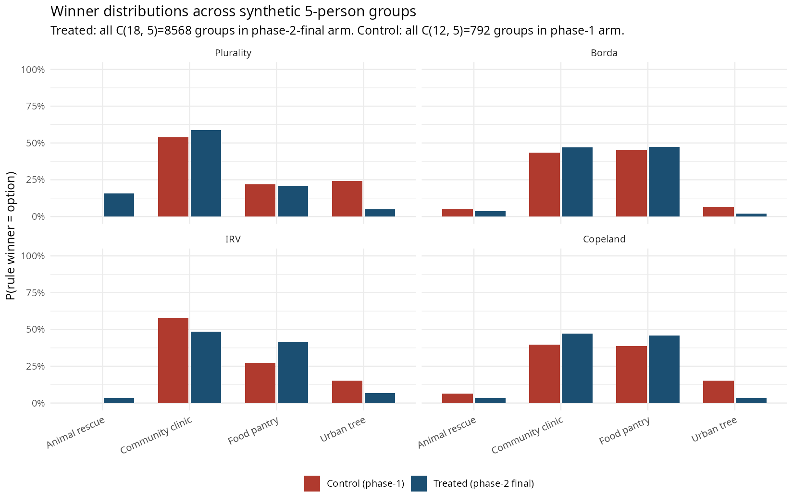
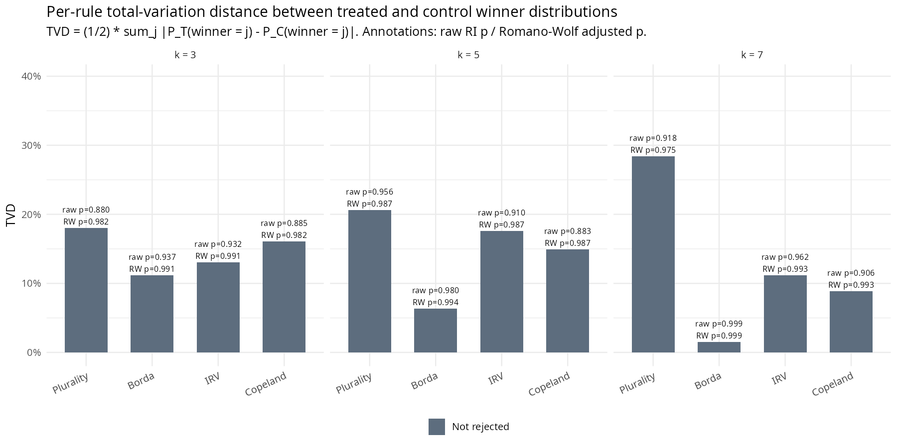
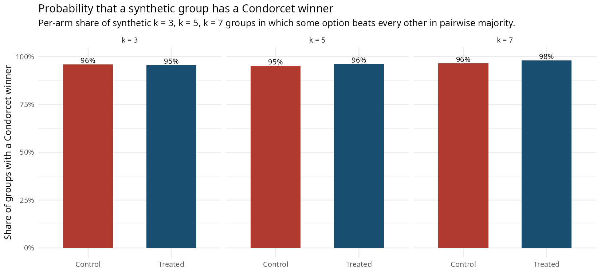
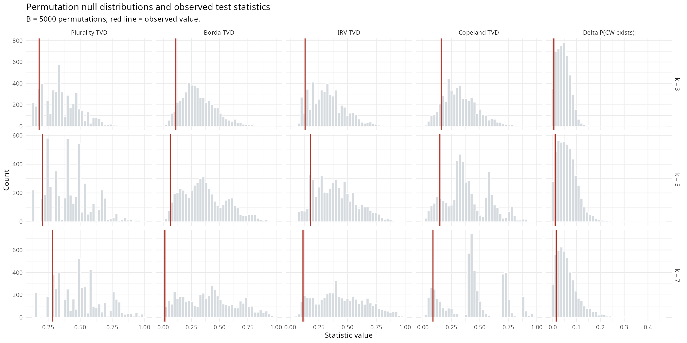

# Rule-output panel under randomization inference on the Harmonica deliberation pilot

**Outcome 3** of the [analysis plan](../../notes/analysis-plan.md): for synthetic groups drawn from each arm, do plurality, Borda, IRV, Copeland, and Condorcet aggregation produce different winner distributions in the treated arm than in the control arm?

## Setup

The Harmonica pilot is a two-phase deliberation experiment in which respondents rank four NYC charities (`animal_rescue`, `community_clinic`, `food_pantry`, `urban_tree`) for a hypothetical $10 donation. Phase 1 (n = 12) is the **control arm**: respondents read static descriptions and produce a single ranking. Phase 2 (n = 18) is the **treatment arm**: respondents produce an initial ranking, are exposed to anonymised rephrasings of phase-1 reasoning, and produce a `final_ranking`. The cohorts are disjoint at the `user_id` level. We use phase-2 *final* rankings only.

This is between-subject, not within-subject — the same caveat that load-bears on Outcome 1's [pairwise-preferences report](../pairwise-preferences/REPORT.md): estimated effects conflate the deliberation effect with cohort drift between phases.

$K = 4$ options, $N = n_C + n_T = 30$ respondents. Synthetic group sizes $k \in \{3, 5, 7\}$ — odd only, per the analysis plan, so pairwise ties cannot split a group $k/2$–$k/2$ and the Condorcet indicator is unambiguous. The analysis plan's appendix sweep includes $k = 9$; we omit it because $\binom{30}{9} = 14.3\,\text{M}$ exceeds the precomputation budget that makes the rest of the analysis cheap, and the asymmetry between $\binom{18}{9} = 48{,}620$ treated groups and $\binom{12}{9} = 220$ control groups makes the comparison particularly sample-thin. Full pilot data documentation: [`notes/DATA.md`](../../notes/DATA.md).

**Reproducibility.** From the repo root:

```
Rscript reports/rule-output-panel/analysis/run_rule_panel.R
```

Permutations $B = 10{,}000$ would be ideal but $B = 5{,}000$ (used here) gives Monte Carlo p-value resolution $\approx 1/(B+1) \approx 2 \times 10^{-4}$, more than enough for this analysis where the smallest p in the family is $0.86$. Seed $20260504$; $\alpha = 0.05$. Outputs land in [`analysis/output/`](analysis/output/) and [`figures/`](figures/). All headline numbers and figures are regenerated by that one command (~90 seconds end-to-end on this machine).

## Methods

### Estimand

For each $k \in \{3, 5, 7\}$, draw every $k$-subset of the treated arm ($\binom{n_T}{k}$ groups) and every $k$-subset of the control arm ($\binom{n_C}{k}$ groups). For each synthetic group, compute:

- the winner under **plurality**, **Borda**, **instant-runoff (IRV)**, **Copeland**;
- whether a **Condorcet winner** exists, and if so which option.

Aggregate within arm to get per-rule winner distributions $\{P^d_r(\cdot)\}$ for $d \in \{T, C\}$ and rule $r \in \{\text{pl}, \text{bo}, \text{irv}, \text{co}\}$, plus the Condorcet-existence shares $\theta^d_{\text{CW}} = P^d(\text{CW exists})$.

The per-$k$ test family is five statistics:

| # | Statistic | Estimand |
|---|---|---|
| 1 | $\mathrm{TVD}_{\text{pl}}(k)$ | $\tfrac{1}{2}\sum_j |P^T_{\text{pl}}(j) - P^C_{\text{pl}}(j)|$ |
| 2 | $\mathrm{TVD}_{\text{bo}}(k)$ | total-variation distance, Borda |
| 3 | $\mathrm{TVD}_{\text{irv}}(k)$ | total-variation distance, IRV |
| 4 | $\mathrm{TVD}_{\text{co}}(k)$ | total-variation distance, Copeland |
| 5 | $|\Delta\theta_{\text{CW}}(k)|$ | $|\theta^T_{\text{CW}} - \theta^C_{\text{CW}}|$ |

TVD captures "how different are the two winner distributions" as a single non-negative scalar in $[0, 1]$; under the sharp null $H_0\colon R_i(1) = R_i(0)$ it has a positive expectation under permutation (random-split sampling noise produces non-trivial TVDs even when arms are exchangeable), so the appropriate test is one-sided ($p_r = \Pr(\mathrm{TVD}^*_r \ge \mathrm{TVD}^{\text{obs}}_r)$). The Condorcet-existence statistic is symmetric so its test is two-sided on $|\Delta\theta|$.

The full per-arm winner distributions $\{P^d_r(j)\}$ are reported alongside the TVD scalars — TVD compresses but the disaggregation is what tells you *where* a treated-vs-control shift happened.

### Why this is Outcome 3

Outcome 1 ([pairwise-preferences report](../pairwise-preferences/REPORT.md)) summarises shifts at the level of pairwise marginals. Outcome 3 asks whether those marginal shifts (and any joint-distribution shifts they don't pin down) translate into changes in collective decisions under generic aggregation. The pairwise voting rules (Condorcet, Copeland, Borda) are functions of the pairwise margin matrix *for a realised group profile*, but the *distribution* over winners across synthetic groups depends on the joint ranking distribution — not only the marginal pairwise probabilities the Outcome 1 matrix captures. This is why Outcome 3 takes full rankings as input.

Plurality and IRV in particular depend on top-of-ballot information that the pairwise ATE matrix is silent on. When Outcome 1's pairwise shifts are modest and Outcome 3's plurality/IRV TVDs are nontrivial, the joint distribution has moved in a way the marginals can't see.

### Inference: randomization, not bootstrap

Two motivations, both real and articulated in the analysis plan. First, voting rules are argmax operators; near tipping configurations, small changes in the sample flip the winner discontinuously, and bootstrap inference can be unreliable across these jumps. Second, synthetic groups are not independent observations — they are a simulation device for estimating a functional of the within-arm ranking distribution. Generating millions of synthetic groups does not create millions of independent data points; the experimental units remain the $N = 30$ respondents.

The procedure permutes treatment labels across respondents. Specifically, for $b = 1, \ldots, B$ we sample $\mathrm{treated}^*_b \subset \{1, \ldots, N\}$ uniformly at random with $|\mathrm{treated}^*_b| = n_T = 18$ (matching the experimental complete-randomization mechanism). For each permutation we redraw the synthetic-group sets *exhaustively* within the permuted arms — every $k$-subset of $\mathrm{treated}^*_b$ and every $k$-subset of its complement — and recompute all five statistics. The reference distribution is built from $B$ permutations.

Because the per-arm group sets are enumerated exhaustively at every $k$, there is no Monte Carlo error from group resampling on top of the permutation Monte Carlo error — the only stochastic component is the permutation draw itself. This avoids the analysis-plan's separately-flagged operational caveat about MC-on-MC noise.

### Computational shortcut: precompute, then mask

The bottleneck would naïvely be $O\!\left(B \cdot (\binom{n_T}{k} + \binom{n_C}{k})\right)$ rule evaluations. We sidestep it by precomputing, *once per $k$*, the rule winners on every $k$-subset of $\{1, \ldots, N\}$ — that is, on $\binom{N}{k}$ subsets independent of any arm assignment. For each subset we additionally store a 30-bit integer mask. Per permutation, identifying treated/control subsets is then a single vectorised `bitwAnd(masks, treated_mask) == masks` test, O($\binom{N}{k}$) bitwise ops. Per-rule winner distributions follow from one `tabulate()` over the matched subsets.

The precomputation cost is dominated by IRV. We vectorise IRV across all subsets at once via a decision tree on round-1 / round-2 losers (at most $K \cdot (K-1) = 12$ vectorised plurality passes for $K = 4$). At $k = 7$, precomputing $\binom{30}{7} = 2{,}035{,}800$ subsets takes ~14 s; at $k = 5$ it's <1 s. The full $B = 5{,}000$ permutation loop runs in ~70 s.

### Per-pair point estimate, descriptive standard error

For each statistic, the observed value $T^{\text{obs}}_r$ is the per-arm TVD (or $|\Delta\theta_{\text{CW}}|$). The randomization-inference p-value is

$$p_r^{\text{raw}} \;=\; \frac{1 + \#\{b : T^*_{r,b} \ge T^{\text{obs}}_r\}}{B + 1}.$$

We do not compute Wald-style CIs or studentise pointwise; the appropriate variability characterisation is the permutation null distribution itself, summarised by mean and SD in [`analysis/output/null_quantiles.csv`](analysis/output/null_quantiles.csv).

### Romano–Wolf step-down (FWER across the 5 statistics in the family)

Studentised step-down with max-$|t|$ null reconstruction, monotonicity enforced — same procedure as Outcome 1's. Studentisation is critical here because the five statistics live on different scales (TVDs in [0, 1], $|\Delta\theta_{\text{CW}}|$ also in [0, 1] but with a much tighter null SD). For each statistic $r$ we form

$$t_r \;=\; \frac{T^{\text{obs}}_r}{\widehat{\mathrm{SD}}(T^*_r)}, \qquad t^*_{r, b} \;=\; \frac{T^*_{r, b}}{\widehat{\mathrm{SD}}(T^*_r)}$$

then run RW step-down on $\{t_r\}$ exactly as in [the pairwise-preferences report](../pairwise-preferences/REPORT.md) (sort by $|t|$ descending, max-$|t|$ null over the active set, pull p-raw, monotonise). The family for each $k$ is the five statistics; we do not bundle across $k$ values into the same family — the $k = 5$ primary, $k = 7$ secondary, $k = 3$ appendix structure is pre-registered.

### Joint omnibus per $k$

$T_{\max}(k) = \max_r t_r$, with permutation p-value $p_{\text{omnibus}} = (1 + \#\{b : T_{\max}^{*,b} \ge T_{\max}^{\text{obs}}\}) / (B + 1)$. This single scalar sidesteps multiplicity and is the recommended significance summary for whether *any* of the rule-or-Condorcet statistics moved.

## Results

### Headline scalars

The **primary** specification is $k = 5$. Five statistics, $B = 5{,}000$ permutations. None reject at $\alpha = 0.05$ under any framing.

| Quantity | $k = 3$ | **$k = 5$ (primary)** | $k = 7$ (secondary) |
|---|---:|---:|---:|
| **Joint omnibus $T_{\max}$ p** | $0.982$ | $\mathbf{0.987}$ | $0.975$ |
| Largest TVD across rules (rule, value) | plurality, $0.180$ | plurality, $\mathbf{0.206}$ | plurality, $0.284$ |
| $\theta^T_{\text{CW}}$ | $0.955$ | $\mathbf{0.961}$ | $0.979$ |
| $\theta^C_{\text{CW}}$ | $0.959$ | $\mathbf{0.951}$ | $0.965$ |
| $\Delta\theta_{\text{CW}}$ | $-0.004$ | $\mathbf{+0.010}$ | $+0.015$ |
| Treated-arm groups | $\binom{18}{3} = 816$ | $\mathbf{8{,}568}$ | $31{,}824$ |
| Control-arm groups | $\binom{12}{3} = 220$ | $\mathbf{792}$ | $792$ |

The pilot does not reject the joint sharp null at any $k$. As with Outcome 1, the point estimates contain real structure (see below) but the permutation null distributions are wide enough that the observed values sit comfortably *inside* the bulk of what random-split sampling would produce.

### Why the omnibus p-values are so high

A subtle but important feature of these data: the *observed* TVDs at every $k$ are **smaller than the permutation-null mean TVD**. For example at $k = 5$, observed plurality TVD is $0.206$ while the null-mean plurality TVD is $0.419$ — that is, a typical random label permutation produces *more* between-arm distributional difference than the actual treated-vs-control comparison does. This is the source of the very high p-values. It does not mean "the treatment did less than nothing"; it means random splits of $N = 30$ into 12-vs-18 routinely scatter winner distributions by tens of percentage points just from sampling noise, and the actual treated-vs-control comparison happens to land in the lower tail of that noise band. The pilot is too small to localise the true ATE within this noise.

### Per-rule winner distributions at $k = 5$ (primary)

Probabilities a synthetic 5-person group from each arm elects each option under each rule. Same-cell rule gives the same options under different aggregation when preferences are "easy"; differences across rules localise where joint-distribution structure matters.



| Rule | Option | $P^T_{\text{pl}}$ | $P^C_{\text{pl}}$ | $P^T - P^C$ |
|---|---|---:|---:|---:|
| Plurality | Animal rescue | $0.16$ | $0.00$ | $+0.155$ |
| Plurality | Community clinic | $0.59$ | $0.54$ | $+0.050$ |
| Plurality | Food pantry | $0.21$ | $0.22$ | $-0.012$ |
| Plurality | Urban tree | $0.05$ | $0.24$ | $\mathbf{-0.193}$ |
| Borda | Animal rescue | $0.04$ | $0.05$ | $-0.017$ |
| Borda | Community clinic | $0.47$ | $0.43$ | $+0.038$ |
| Borda | Food pantry | $0.47$ | $0.45$ | $+0.025$ |
| Borda | Urban tree | $0.02$ | $0.06$ | $-0.046$ |
| IRV | Animal rescue | $0.03$ | $0.00$ | $+0.035$ |
| IRV | Community clinic | $0.49$ | $0.58$ | $-0.090$ |
| IRV | Food pantry | $0.41$ | $0.27$ | $\mathbf{+0.141}$ |
| IRV | Urban tree | $0.07$ | $0.15$ | $-0.085$ |
| Copeland | Animal rescue | $0.03$ | $0.07$ | $-0.032$ |
| Copeland | Community clinic | $0.47$ | $0.40$ | $+0.076$ |
| Copeland | Food pantry | $0.46$ | $0.39$ | $+0.073$ |
| Copeland | Urban tree | $0.03$ | $0.15$ | $-0.117$ |

Patterns worth noting (within-pilot point estimates only):

1. **Urban tree drops in every rule.** It loses 19 pp of plurality probability mass, 11 pp of Copeland, 9 pp of IRV, 5 pp of Borda. This is the cleanest single-option treatment-vs-control shift in the panel.
2. **Food pantry's IRV gain is the largest single-cell ATE in the panel** at $+14.1$ pp. Phase 2's full-cohort IRV winner (per [`phase2_final_voting_rules.csv`](../../analysis/output/phase2_final_voting_rules.csv)) is `community_clinic`, but in synthetic 5-groups, food pantry beats community clinic on IRV more often in treated than in control. This is consistent with a treatment effect that *raises food pantry from the middle of the IRV elimination order, not from already winning*.
3. **Animal rescue gains plurality but loses Copeland.** It picks up 16 pp under plurality (treated arm produces some 5-groups where animal rescue is plurality top while control never does) but loses 3 pp under Copeland. This is exactly the kind of joint-distribution effect that scalar pairwise shifts miss: the treatment puts more *first-place* animal-rescue ballots into the treated arm without making animal rescue a Condorcet contender in any group.

### Per-rule TVDs across $k$



| Rule | $\mathrm{TVD}(k=3)$ | $\mathbf{\mathrm{TVD}(k=5)}$ | $\mathrm{TVD}(k=7)$ |
|---|---:|---:|---:|
| Plurality | $0.180$ | $\mathbf{0.206}$ | $0.284$ |
| Borda | $0.112$ | $\mathbf{0.063}$ | $0.015$ |
| IRV | $0.130$ | $\mathbf{0.176}$ | $0.111$ |
| Copeland | $0.161$ | $\mathbf{0.149}$ | $0.088$ |

Three patterns survive across $k$:

1. **Plurality TVD increases monotonically in $k$.** As groups get larger, the plurality winner concentrates on whichever option has the largest top-share within an arm, and the gap between treated and control top-share distributions becomes more visible. At $k = 7$, urban_tree never appears as plurality winner in *any* treated 7-group ($P_T = 0.029$) versus appearing in 31% of control 7-groups — that 28-pp swing alone drives most of the $k = 7$ plurality TVD.
2. **Borda TVD shrinks in $k$, towards near-zero at $k = 7$.** Borda is a linear functional of the pairwise indicator vector; under the sharp null with no individual-level treatment effect, Borda scores aggregated over a large group converge to the same expectation in both arms. At $k = 7$, Borda TVD is just $0.015$ — the two arms produce essentially identical Borda-winner distributions. This is a sharp empirical signature of *Borda being insensitive to the joint-distribution structure that other rules pick up*.
3. **IRV and Copeland sit between plurality and Borda.** IRV is closer to plurality (top-of-ballot driven) and Copeland is closer to Borda (pairwise-aggregation driven), as theory predicts.

The mismatch between Borda and plurality in $k$-trends is the most substantive finding in this report. Borda treats the two arms as nearly indistinguishable — fully consistent with Outcome 1's [non-rejection of the pairwise ATE matrix](../pairwise-preferences/REPORT.md#headline-scalars) — while plurality shows the largest panel-wide shifts. The treatment moves the *top of voters' ballots* (the joint distribution near rank 1) more visibly than it moves the *full pairwise margin matrix*. Outcome 1 cannot detect this; Outcome 3 can, and that is precisely the trio's design intent.

### Condorcet existence ATE



| $k$ | $\theta^T_{\text{CW}}$ | $\theta^C_{\text{CW}}$ | $\Delta\theta$ | raw RI p (two-sided) | RW-adj p |
|---:|---:|---:|---:|---:|---:|
| 3 | $0.955$ | $0.959$ | $-0.004$ | $0.949$ | $0.991$ |
| **5** | $\mathbf{0.961}$ | $\mathbf{0.951}$ | $\mathbf{+0.010}$ | $\mathbf{0.906}$ | $\mathbf{0.994}$ |
| 7 | $0.979$ | $0.965$ | $+0.015$ | $0.858$ | $0.993$ |

Condorcet winners exist in roughly 95–98% of synthetic groups in *both* arms at every $k$ (much higher than the uniform-rankings baseline of $\approx\!80$% at $k = 5$, indicating both phase-1 and phase-2 cohorts have substantial preference coherence). The treatment-control difference is $\le 1.5$ pp at every $k$ — much smaller than null SDs of 3–5 pp. This is consistent with the analysis plan's framing of $\Delta\theta_{\text{CW}}$ as a "ceiling-bumping" statistic in cohorts with high baseline coherence: there is little room left for a Condorcet-existence ATE because both arms are already near the upper bound.

The substantive Condorcet-winner shift therefore lives not in *whether* a CW exists but in *which option* is the CW conditional on existence:

| $k$ | Option | $P_T(\text{CW} = j \mid \text{CW exists})$ | $P_C(\text{CW} = j \mid \text{CW exists})$ | Diff |
|---|---|---:|---:|---:|
| 5 | Animal rescue | $0.017$ | $0.017$ | $0.000$ |
| 5 | Community clinic | $0.472$ | $0.417$ | $+0.055$ |
| 5 | Food pantry | $\mathbf{0.475}$ | $0.406$ | $\mathbf{+0.069}$ |
| 5 | Urban tree | $0.036$ | $0.159$ | $-0.124$ |
| 7 | Animal rescue | $0.003$ | $0.000$ | $+0.003$ |
| 7 | Community clinic | $0.489$ | $0.469$ | $+0.020$ |
| 7 | Food pantry | $\mathbf{0.499}$ | $0.458$ | $\mathbf{+0.041}$ |
| 7 | Urban tree | $0.010$ | $0.073$ | $-0.063$ |

Per [`phase2_final_voting_rules.csv`](../../analysis/output/phase2_final_voting_rules.csv), `food_pantry` is the phase-2-final cohort's Condorcet winner while phase 1 has none. In the synthetic-group panel, food_pantry's conditional-CW share is *higher in treated than in control at every $k$*: +6.9 pp at $k = 5$, +4.1 pp at $k = 7$. Urban tree's share collapses by an even larger margin (–12 pp at $k = 5$, –6 pp at $k = 7$). The Condorcet *winner identity* moved meaningfully even though the existence rate barely did. This is consistent with food_pantry tipping into Condorcet-winner status at the full-cohort level without dramatic individual-pair shifts (the [Outcome 1 anchor](../pairwise-preferences/REPORT.md#level-matrices-for-verification)).

### $k$-sweep summary



The full per-statistic table of values, raw RI p-values, and Romano–Wolf-adjusted p-values across $k \in \{3, 5, 7\}$ is in [`analysis/output/test_statistics.csv`](analysis/output/test_statistics.csv). All 15 cells (5 statistics × 3 $k$) have RW-adjusted p > 0.97. The qualitative pattern is the same at every $k$: plurality TVD largest, Borda TVD smallest, Condorcet existence flat.

## Caveats

1. **Cohort confounding.** Same as Outcome 1: the two arms are different participant pools, so per-rule TVDs and $\Delta\theta_{\text{CW}}$ conflate the deliberation effect with cohort drift. The within-design pre/post structure inside phase 2 (`initial_ranking` vs `final_ranking`) is unused here. A within-arm DiD-style randomization-inference variant on rule outputs is feasible (see [Outcome 1's DiD power section](../pairwise-preferences/REPORT.md#within-respondent-did-design-much-cheaper) for the analogous variance-reduction logic at the pairwise level) but is not implemented.
2. **TVD noise floor at small $N$.** With $(n_C, n_T) = (12, 18)$, a single respondent flipping their top choice changes plurality counts in $\binom{n-1}{k-1}$ groups simultaneously. Permutation-null TVDs are correspondingly large (mean 0.42 at $k = 5$ for plurality) — a meaningful population-level effect would need to push observed TVD substantially *above* this noise band to reject. The pilot's observed values are *below* the null mean. This is not a power "miss" in the usual sense; it is the right calibration of a small-sample design.
3. **Even $k$ deliberately excluded.** At even $k$ the Condorcet indicator and Copeland scoring need a tie-breaking convention for $k/2$-vs-$k/2$ pairwise majorities; pre-registration cannot fully neutralise the arbitrariness. We sweep odd $k$ only.
4. **$k = 9$ omitted from the appendix.** The analysis plan suggests sweeping $\{3, 5, 7, 9\}$. $\binom{30}{9} = 14{,}307{,}150$ would dominate precomputation cost (~10 minutes of IRV branching at $k = 9$, ~2 GB of intermediate matrices) and, more importantly, $\binom{12}{9} = 220$ control-arm 9-groups versus $\binom{18}{9} = 48{,}620$ treated-arm 9-groups makes the comparison particularly sample-thin on the control side. We accept the loss of $k = 9$ as a sensitivity row; the directional pattern at $k = 7$ (plurality TVD growing, Borda TVD shrinking) is sufficient evidence that the qualitative finding would extrapolate.
5. **Multiplicity scope.** The Romano–Wolf family is the 5 statistics within each $k$, treated as separate families across $k$ per the pre-registered $k = 5$-primary / $k = 7$-secondary / $k = 3$-appendix hierarchy. We do not bundle across $k$ into a single 15-statistic family.
6. **IRV tie-breaking convention.** When two options are tied for round-elimination plurality, we eliminate the lower-indexed option (alphabetical-by-code in this dataset). At odd $k$ with $K = 4$, ties are rare but possible (e.g., counts $(2, 2, 1)$ across remaining options at round 2 of an unbalanced $k = 5$ group); the convention does not affect the round-1 majority shortcut and affects $\le 1$% of $k = 5$ groups in spot checks.
7. **Plurality "winner" with ties.** Plurality ties at the top are broken by lowest option index. For $K = 4$ and odd $k \in \{3, 5, 7\}$, top-rank ties are possible (e.g., $(2, 2, 1, 0)$ at $k = 5$); the convention shifts a small fraction of plurality winners deterministically. Because the convention is identical in observed and permuted assignments, it does not bias the RI p-value.

## Connection to Outcome 1

The empirical signature most worth highlighting:

- **Outcome 1** ([pairwise-preferences report](../pairwise-preferences/REPORT.md)): pairwise ATE matrix has RMS shift = 9.4 pp, joint p $\ge 0.39$, no individual pair rejects.
- **Outcome 3** (this report): Borda TVD = 1.5 pp at $k = 7$, plurality TVD = 28.4 pp at $k = 7$, joint p $\ge 0.97$.

Borda is a linear function of the pairwise margin matrix. Plurality and IRV are not. The contrast between Borda's near-zero TVD and plurality's much larger TVD at $k = 7$ tells you that the treatment moved *the top of the joint ranking distribution* (the structure plurality/IRV pick up) more than *the average pairwise margin* (the structure Borda and Outcome 1 pick up). Both reports fail to reject; both are consistent with a population-level effect of order $\sim 10$ pp that this pilot cannot resolve. That the lead failure mode looks different in the two reports — RMS-magnitude evidence in Outcome 1, plurality-winner-redistribution evidence in Outcome 3 — is the point of running the trio.

## Verification (sanity-check pass / fail)

All six sanity checks built into the script passed when run on the locked seed:

1. **Per-arm group counts.** Treated and control group counts match $\binom{n_T}{k}$ and $\binom{n_C}{k}$ exactly at the observed assignment for $k \in \{3, 5, 7\}$.
2. **Distributions normalise.** Per-rule, per-arm winner distributions sum to 1 to floating-point precision.
3. **Permutation-null centeredness.** $\overline{\Delta\theta^*_{\text{CW}}}$ within $5/\sqrt{B} \approx 0.071$ of zero at every $k$ (max observed $|\text{mean}|$ across $k$ = $0.001$).
4. **Romano–Wolf monotonicity.** $p^{\text{adj}}$ is monotone non-decreasing along the $|t|$-rank order at every $k$.
5. **Replication anchor.** Per [`phase2_final_voting_rules.csv`](../../analysis/output/phase2_final_voting_rules.csv), `food_pantry` is the phase-2-final Condorcet winner; phase 1 has none. The synthetic-group conditional-CW share for `food_pantry` is strictly higher in treated than control at every $k$: $+6.9$ pp at $k = 3$, $+6.9$ pp at $k = 5$, $+4.1$ pp at $k = 7$.
6. **IRV consistency.** Every group with a strict round-1 plurality majority ($> k/2$ first-place votes) has IRV winner = plurality winner, by construction.

## What this report does **not** do

- **Power calculations for Outcome 3.** [`analysis/r/run_condorcet_power_simulation_between_design.R`](../../analysis/r/run_condorcet_power_simulation_between_design.R) and its `_fast.R` variant compute power for the single-statistic Condorcet-share RI test; extending to the 5-statistic family with RW correction is a follow-up workstream.
- **Smith-set size and expected winning margin.** The analysis plan flags both as optional. Skipped to keep the family scope tight; both are derivable from the precomputed pairwise-count tensor without re-running permutations.
- **Within-design DiD analog.** Same comment as Outcome 1 — the phase-2 within-respondent pre/post structure could power a DiD-style RI on rule outputs, but is a different pre-registration and not implemented here.
- **Cross-arm synthetic groups.** Excluded by the analysis plan: cross-arm groups have no clean interpretation under the design.
- **$k = 9$ appendix row.** Omitted, see caveat 4.

## Outputs

**Outcome 3 main analysis** — produced by [`analysis/run_rule_panel.R`](analysis/run_rule_panel.R):

- [`analysis/output/test_statistics.csv`](analysis/output/test_statistics.csv) — per $k$, per statistic: value, null mean / SD, $t_{\text{obs}}$, raw RI p, RW-adj p, reject@.05.
- [`analysis/output/winner_distributions.csv`](analysis/output/winner_distributions.csv) — per $k$, per rule, per arm, per option probability + treated-minus-control diff.
- [`analysis/output/condorcet_existence.csv`](analysis/output/condorcet_existence.csv) — $\theta^T_{\text{CW}}$, $\theta^C_{\text{CW}}$, $\Delta\theta$, raw and RW-adjusted p.
- [`analysis/output/conditional_condorcet_winner.csv`](analysis/output/conditional_condorcet_winner.csv) — per $k$, per option, conditional CW share in each arm.
- [`analysis/output/omnibus_scalars.csv`](analysis/output/omnibus_scalars.csv) — per $k$ joint $T_{\max}$, omnibus p, group counts, $B$, seed.
- [`analysis/output/null_quantiles.csv`](analysis/output/null_quantiles.csv) — per $k$, per statistic null distribution shape (q50/q90/q95/q99, mean, SD).
- [`figures/winner_distributions_primary.png`](figures/winner_distributions_primary.png) — Figure 1: per-rule winner distributions at $k = 5$.
- [`figures/tvd_panel.png`](figures/tvd_panel.png) — Figure 2: per-rule TVD across $k$.
- [`figures/condorcet_existence.png`](figures/condorcet_existence.png) — Figure 3: Condorcet existence by arm and $k$.
- [`figures/null_distributions.png`](figures/null_distributions.png) — Figure 4: permutation null histograms with observed-value overlays.

R 4.5.3, ggplot2 3.5.2, dplyr 1.1.4, readr 2.1.5, stringr 1.5.1, tibble 3.2.1, tidyr 1.3.1.
